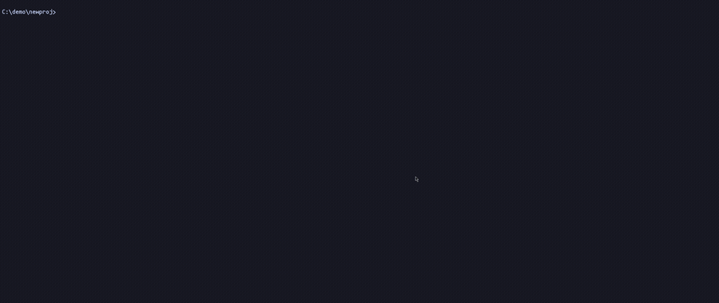
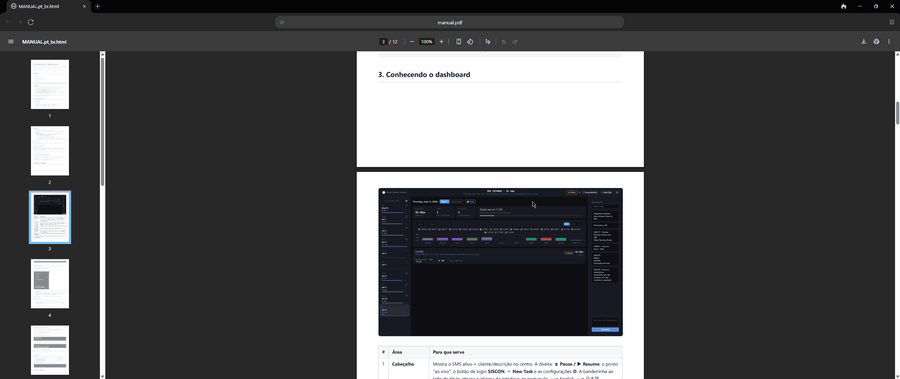

# nix

A Zig rewrite of [onix](../onix) — the same fast directory alias resolver, with the Go runtime shed. Type `o acme` from any prompt; your shell jumps to the project root. One TOML file holds every alias, one binary serves every command, and the resolve hot path lands at **~4.4 ms vs onix's ~9 ms** — roughly **2× faster per invocation**, in a **1.23 MB** binary (onix is 3.48 MB).

nix is a drop-in: it reads and writes the same `~/.onix` layout, the same `aliases.toml`, `config.toml`, `usage`, and segment files, in onix's exact byte-for-byte formats. It can share a home with onix or stand alone. Full functional parity is verified command-by-command against the Go reference.

## Demos

**Jump to any project.** `o acme` stacks a shell rooted at the alias directory; `o newproj C:\path` registers a new alias and jumps there in one step (the directory is auto-created).


**Search inside PDFs, office docs and archives.** `sg <alias> <pat> --all` runs the search with [ripgrep-all](https://github.com/phiresky/ripgrep-all) — matches found *inside* documents become individual, content-filterable fzf rows; pick one and it opens in your editor (text) or its default app (PDF).



**Clipboard → file from any prompt.** `p <alias> [name]` drops the clipboard into the alias directory — a screenshot saves as `.png`, text as `.md`, Explorer-copied files/folders copy in recursively — and copies the saved path back out.



## Why

onix is already fast — about 0.6 ms over the OS process-spawn floor. But every invocation still pays for the Go runtime bootstrap (~2 ms) and onix's linked dependency graph (go-toml/json/reflect, another ~2 ms). nix is the experiment: how much of that is sheddable with a hand-written hot path and no runtime?

| Binary | Resolve time | Size |
|--------|-------------|------|
| **nix** (Zig, ReleaseFast) | **~4.4 ms** | 1.23 MB |
| onix (Go, `-s -w`) | ~9 ms | 3.48 MB |
| Zig no-op | 3.31 ms | 4.6 KB |

The Zig no-op (a bare `CreateProcess` returning immediately) is the floor on this machine. nix's full hot path — resolve + mkdir + usage record — sits ~1 ms above it. The remainder is everything the Go runtime no longer has to do. ~3,500 lines of Zig across 9 modules.

## Install

### Windows (Scoop)

```powershell
scoop bucket add sadirano https://github.com/sadirano/bucket
scoop install nix
```

The Scoop package pulls in the tools the interactive commands lean on (`bat`, `fzf`, `ripgrep`, `fd`, `neovim`) and runs `nix --init` for you on install. `scoop update nix` tracks new releases.

[Everything](https://www.voidtools.com/)'s `es` CLI is an optional extra (`scoop install everything-cli`): when present and running it gives the `o <name>` picker instant, whole-system reach across every drive. It is **not required** — `es` needs the Everything app/service, which some environments can't install, so the picker falls back to walking your drives with `fd`. See the `[picker]` configuration section to tune that fallback.

### Prebuilt binaries

Each tagged release publishes a Windows `.zip` on the [Releases](https://github.com/sadirano/nix/releases) page — download, unpack, put `nix.exe` on your `PATH`, then run `nix --init`.

### Build from source

Requires [Zig 0.16+](https://ziglang.org/download/).

```powershell
zig build -Doptimize=ReleaseFast    # -> zig-out\bin\nix.exe
zig-out\bin\nix.exe --init
```

On Windows, prefer the portable build helper — a native build bakes the dev machine's CPU extensions into the binary and crashes with an illegal instruction on any machine lacking them:

```powershell
.\nix-build.cmd        # zig build … -Dtarget=x86_64-windows -Dcpu=baseline, then --sync
```

`nix --init` creates `~/.onix/`, writes a shell snippet to `~/.onix/shell/`, installs the `.exe` command wrappers into `~/.onix/bin` (and adds it to your user PATH), and dot-sources the snippet from your shell profile (`$PROFILE` on Windows, `.bashrc`/`.zshrc`/`.profile` on Unix-likes). Restart your shell (or source your profile) once and the short commands below are live.

Because nix writes nix-branded artifacts (`nix.ps1`, `nix.sh`, copied wrappers) into the shared home, it coexists with an existing onix install in the same `~/.onix` rather than clobbering it.

## Use

```powershell
nix acme C:\Users\dev\projects\acme        # register an alias (auto-creates the dir if missing)
o acme                                     # cd into it (in your current shell)
o acme C:\Users\dev\projects\acme          # register + cd in one step (dir auto-created)
o                                          # no args: open aliases.toml in your editor
e acme                                     # open it in your editor
s acme                                     # open it in Explorer
s acme report.pdf                          # open a file with its default app (PDF→viewer, .zip→archiver…)
y acme                                     # print the path and copy it to the clipboard
y acme invoice                             # pick files (fzf) → copy the FILES to the clipboard
p acme                                     # save clipboard content into the alias dir, copy the saved path back
p acme shot                                # …with a name (image→shot.png, text→shot.md)
r acme zig build test                      # run a command at that path
sg acme TODO                               # ripgrep search under the dir → fzf → open the hit in your editor
sg acme invoice --all                      # search inside PDFs/office docs/archives too (ripgrep-all)
ff acme config                             # fuzzy-find files under the dir → fzf → open the selection
o docs@acme                                # jump to a sub-alias segment (see Sub-aliases below)
nix --list                                 # show every alias
nix --edit                                 # open ~/.onix in your editor
nix acme --remove                          # forget the alias
```

The `o` command changes the **current** shell's working directory — it does not spawn a new shell. Three forms:

- `o <alias>` — resolve and cd. If the alias is unknown, `o` prompts for a destination (or runs the directory picker), registers, and cds.
- `o <alias> <path>` — register (or update) the alias to point at `<path>` and cd there. The directory is auto-created if it doesn't exist.
- `o` (no args) — open `aliases.toml` in `$EDITOR`. Use `nix --list` if you want a tabular dump to stdout instead.

Everything else (`e`, `s`, `y`, `p`, `r`, `sg`, `ff`) invokes `nix` directly, so those don't need shell integration to work.

`s <alias> <file>` opens a single file with its registered default application instead of the file manager — a PDF in your viewer, a `.zip` in your archiver, and so on. The file is resolved against the alias directory and opened by the OS handler (`explorer.exe` / `xdg-open`).

`y <alias>` prints the alias path and copies it to the clipboard as text. Given a pattern — `y <alias> <pat>` — it instead runs the `ff` file picker under the alias dir and copies the **selected files themselves** to the clipboard as a system file drop (Windows `CF_HDROP`), so a paste in Explorer drops the real files (a `.png` lands as a file, not a path). It's the inverse of `p`. On non-Windows the file-drop format isn't available, so it falls back to copying the paths as text.

`p <alias> [name]` saves the current clipboard contents into the alias directory and copies the saved path(s) back to the clipboard. Files copied in Explorer (Ctrl+C) take priority — directories are copied recursively, turning the clipboard into a cross-folder copy channel from any prompt. Otherwise the content path applies, handy for parking a screenshot and pasting its path into an agent: an image saves as `.png` (decoded from the clipboard DIB and re-encoded with real DEFLATE compression), text as `.md`. An explicit extension on `<name>` is honoured; with no name, files keep their source name and content uses a timestamp. Collisions auto-increment (`shot.png`, `shot-1.png`) so nothing is ever clobbered.

## Search and find

`sg <alias> <pat>` runs a ripgrep search rooted at the alias directory and streams the matches into an fzf picker with a live `bat` preview. Each match line is its own row, so you narrow by content as you type; Tab marks several, Enter opens the selection(s) in your editor at the matched line.

`sg <alias> <pat> --all` (or `-a`) searches with [ripgrep-all](https://github.com/phiresky/ripgrep-all) (`rga`) instead, so matches reach **inside PDFs, office documents, archives, ebooks, and more** — not just plain text. Each hit is still an individual, content-filterable fzf row. The preview adapts to what you land on: a directory lists its entries, a text file renders in `bat` with the matched line highlighted, and a document shows the extracted text trimmed to the selected match. Opening adapts the same way — a text hit opens in your editor at the line, while a PDF/office hit opens in its default app (its "line" is really a page, not an editor position). Set `[grep] all = true` in `config.toml` (see below) to make `rga` the default for every `sg`.

`ff <alias> [pat]` fuzzy-finds files under the alias directory — using Everything's `es` on Windows, else `fd`, else `find` — into the same fzf-with-preview picker. Enter opens the selection: directories and registered default-app file types (PDF, images, archives, …) open with the OS handler, everything else in your editor.

## Configuration

Aliases live in `~/.onix/aliases.toml`. The format is one TOML table per alias:

```toml
[acme]
path = "C:/Users/dev/projects/acme"
```

You can hand-edit the file (`nix --list` and resolve pick up changes immediately) or use `nix <name> <path>` to register and `nix <name> --remove` to forget. Alias lookups are case-insensitive.

When the list grows crusty, `nix --prune` opens an fzf multi-select of every alias ranked prune-first: dead targets (directory gone), then never-used, then least-recently used. Tab marks, Enter removes the marked aliases, Esc cancels; `nix --prune --no-prompt` just prints the ranking. The ranking comes from `~/.onix/usage`, a small file the resolve paths maintain automatically (debounced to at most one write per alias per hour, so the hot path stays hot; delete it any time to start fresh). The ranking is byte-for-byte identical to onix's.

Editor is taken from `$EDITOR`, then `$VISUAL`, then the first of `nvim`, `vim`, `code`, `nano`, or `notepad` found on PATH. Override the home location with `$ONIX_HOME`.

## Configuring shortcuts and search

`~/.onix/config.toml` holds three optional sections.

`[shortcuts]` renames the built-in command functions. The keys are the built-in names (`o`, `e`, `s`, `y`, `p`, `r`, `sg`, `ff`); the value is the name you'd rather type:

```toml
[shortcuts]
s = "show"     # type `show acme` instead of `s acme`
ff = "fzf"
```

`[grep]` tunes the `sg` search UI — the fzf preview window and command, fzf colors, ripgrep `--colors`, and whether non-ASCII query characters are matched literally. `all = true` makes `sg` search with [ripgrep-all](https://github.com/phiresky/ripgrep-all) (`rga`) by default, reaching into PDFs, office docs, archives, and more:

```toml
[grep]
preview_window = "right:50%"
rg_colors = ["match:fg:yellow", "path:fg:cyan"]
all = true
```

Per search, `sg <alias> <pat> --all` (or `-a`) switches that one run to `rga` without changing the config default.

`[picker]` filters the unknown-alias directory picker (Everything `es` + fzf), which `o` runs in-process when you navigate to a name that isn't an alias yet. By default it excludes any path component starting with `.`, `_`, or `[`, plus dependency/build/cache trees (`node_modules`, `site-packages`, `cache`, `bin`, `obj`, `build`, `dist`, …), the Windows system trees (`C:\Windows\`, `C:\Program Files`, `AppData`, …), and store-owned install trees (`scoop\apps`, `steamapps`) — so the result cap is spent on directories worth picking.

Setting `exclude` replaces the default list entirely (`exclude = []` turns filtering off); `exclude_extra` extends it — the place for machine-specific noise (TOML literal strings save the backslash-doubling):

```toml
[picker]
exclude_extra = ['\XboxGames\', '\Engine\']
```

Everything's `es` indexes every drive instantly, which is what makes the picker feel instant. Where `es` isn't available — any non-Windows host, a Windows box without Everything, or one where `es.exe` is installed but the Everything service can't run (e.g. locked-down corporate machines) — the picker falls back to walking a set of roots with `fd` (then POSIX `find`), listing directories whose path contains the typed name. A present-but-non-functional `es` (returns nothing) transparently falls through to this walk, so the picker never dead-ends on a dead `es`. `search_roots` lists those roots (`~` is expanded); unset, it defaults to **every fixed drive** on Windows (your home directory elsewhere), pruning the OS trees (`Windows`, `Program Files`, …) so a whole-drive walk stays quick. Point `search_roots` at the trees your projects actually live in to narrow and speed it up:

```toml
[picker]
search_roots = ['~/projects', 'D:\work']
```

`nix --sweep` finds noise you didn't think of: it scans the whole Everything index for directories with 100+ unfiltered subfolders (`--min N` tunes the threshold) and offers the worst offenders in an fzf multi-select. Enter appends the marked subtrees to `~/.onix/picker.swept` (a third exclusion layer, one fragment per line); `--no-prompt` just prints the ranking. Directories containing a registered alias target are never offered.

After editing, run `nix --sync` and `. $PROFILE` (or restart PowerShell) to pick up renamed shortcuts or picker changes.

## Sub-aliases (`@`-segments)

Append subdirectory shortcuts to any alias with `@`. Each segment is defined as a `[[contexts]]` entry, resolved by searching three places, first match wins:

1. **Per-alias, local:** `<alias-path>/.onix/segments.toml`
2. **Per-alias, central:** `~/.onix/segments/<alias>.toml`
3. **Global:** `~/.onix/segments.toml` — but only entries marked `scope = "global"` are visible here.

```powershell
o docs@acme              # cd into <acme-path>/documentation
e src@acme               # editor at <acme-path>/source
o tasks:432@acme         # inline value: cd into <acme-path>/tickets/432
o client:bob@projb       # multi-segment, innermost first
```

```toml
# ~/.onix/segments.toml — entries in the global file must opt in with scope = "global"
[[contexts]]
segment = "docs"
scope = "global"
source-template = "/documentation"   # leading `/` makes it a subdirectory

[[contexts]]
segment = "tasks"
scope = "global"
source-template = "/tickets/${tasks}"   # ${tasks} binds to the inline value
```

Per-alias files need **no** `scope` — every entry there is implicitly scoped to that alias. Only the shared global file requires the opt-in.

A segment resolves through its `source-template`: a string with `${VAR}` references. For each `${name}`, nix looks up, in order, (1) the segment's inline value (`seg:value`), bound under `${<segment>}` — or `${param}` if the context sets `param`; (2) the context's `env` map; (3) the process environment. Templates own their separators — `"/foo"` appends as a subdirectory, `"_${task}.md"` appends as a filename suffix.

Encountering an unknown segment opens your editor on the central per-alias file seeded with a `[[contexts]]` skeleton. Lookups are case-insensitive, and `nix --contexts` prints the contexts defined in the global `~/.onix/segments.toml`.

## Groups (`+` multi-alias)

A **group** is a named set of aliases, kept in `~/.onix/groups.toml`. Use it to jump to several projects at once, or to fan a search/run/yank across all of them. Groups are referenced with the `+` sigil — and because of that, `+` is not allowed in alias names.

```powershell
o pa+work                # add alias `pa` to group `work` (creates it), then navigate
o +work                  # pick members in fzf: the first selection cd's the current
                         #   shell, each additional selection opens a new terminal
sg +work TODO            # ripgrep across every member's dir, into one fzf picker
ff +work config          # fuzzy-find files across every member
r  +work git pull        # run a command in each member dir (per-dir header)
y  +work                 # copy every member path to the clipboard
nix --groups             # list all groups
nix +work --list         # list a group's members (each resolved to its path)
nix pa+work --remove     # drop a member
nix +work --remove       # delete the group
```

Members are **alias names**, resolved on use — move an alias and its groups follow; a member whose alias was removed is skipped with a note (and `nix <alias> --remove` strips it from every group). A group may contain another group as a `+other` member, expanded recursively (cycles and runaway nesting are guarded). The file is flat and hand-editable:

```toml
work = ["pa", "pb"]
all  = ["+work", "pc"]   # nested
```

When `o +group` opens more than one selection, the **first** keeps the current shell and the rest each launch a new terminal via `[nav] terminal` in `config.toml` — a command template with a `{dir}` placeholder. On Windows this defaults to `wt -d {dir}` (falling back to a `start` console window); elsewhere set it explicitly:

```toml
[nav]
terminal = "wezterm start --cwd {dir}"
```

## Per-alias actions

Save named commands per alias and run them from anywhere with `r <alias> :<name>` — like `package.json` scripts, but language-agnostic. Actions are plain shell strings (so `&&`, pipes, and redirects work), run in the alias directory.

```toml
# <alias-dir>/.onix/actions.toml   (commit it with the project)
[actions]
test   = "zig build test"
serve  = "npm run dev"
deploy = "./scripts/build.sh && rsync -a dist/ host:/srv"
```

```powershell
r acme :test         # run acme's `test` action in acme's dir
r acme :             # list acme's actions
r acme -o :serve     # run the action detached, in a new window
r +work :test        # run each member's own `test` action (members without it are skipped)
```

Actions resolve from two places, **project-local winning**: `<alias-dir>/.onix/actions.toml` (travels with the repo) overrides `~/.onix/actions/<alias>.toml` (private, per-machine). A leading `:` is what marks a saved action — without it, `r <alias> <cmd>` still runs `<cmd>` literally.

For full scripts rather than one-liners, drop an executable in the alias's `.onix/scripts/` (or the central `~/.onix/scripts/`) and run it by bare name — `r acme build` runs `<acme>/.onix/scripts/build.cmd`. The scripts dir is put on `PATH` in any alias context, so a project `build` shadows a global one, scripts can call each other, and — best of all — **inside an `o acme` shell the project's own `build`/`clean`/… just work as commands**, with no global versions and scoped to that shell (exit it and they're gone). It fans out too: `r +work build` runs each member's own script. Project-local first, then central; on Windows the extension (`.cmd`/`.bat`/`.exe`/`.ps1`) is resolved for you.

## Tab completion

Every command that takes an alias (`o`, `e`, `s`, `y`, `p`, `r`, `sg`, `ff`) supports tab-completion of alias names. The completer calls `nix --list-names` under the hood — a dedicated hot path that bypasses TOML parsing for sub-millisecond Tab response.

cmd.exe via clink is intentionally out of scope for nix; PowerShell completion plus `$PROFILE` wiring cover the supported shells.

## Commands

`nix --init` initialises `~/.onix`, installs the PowerShell snippet, and on Windows installs the `.exe` command wrappers into `~/.onix/bin` and adds it to your user PATH (re-run any time; it's idempotent). `nix --sync` regenerates the snippet and refreshes the wrappers after you move the binary or edit `config.toml`. `nix --prune` interactively removes stale aliases. `nix --version` prints the build version and OS/arch. `nix --help` lists everything.

`nix --doctor` (`-D`) is a read-only health check for when the `o <name>` picker misbehaves. It reports the build and wrapper state (flagging a stale wrapper or a `~/.onix/bin` that isn't on PATH), which finder the picker will actually use — distinguishing a working `es` from one that's installed but whose Everything service isn't running, and **real `fd` from a same-named `.cmd`/`.bat` shim that shadows it** — the resolved search roots (skipping BitLocker-locked drives), the optional tools (`bat`/`rg`/`rga`/editor), and your config/alias state. Every probe is non-interactive and safe to run on locked-down machines; it exits non-zero if any core check fails, so `nix --doctor && …` works in scripts.

## Architecture

nix mirrors onix's module split, hand-written in Zig for the hot path:

- **`src/store.zig`** — `aliases.toml`: byte-scan resolve, quote unescaping, `fromSlash` → host separators, atomic temp+rename writes, name validation.
- **`src/segments.zig`** — `@`-segment grammar, `${VAR}` template expansion, `[[contexts]]` reading with local→central→global precedence and the traversal guard.
- **`src/config.zig`** — `config.toml`: `[shortcuts]`, `[grep]`, `[picker]` (composed + deduped exclusion list shared by sweep/picker).
- **`src/proc.zig`** — process spawning: `runInherit`/`runDetached`/`findInPath`/`runFilter`/`runPipeline`. Streams `rg | fzf` live by relaying bytes through the parent with `File.readStreaming`.
- **`src/clipboard.zig`** — Win32 clipboard read/write (CF_UNICODETEXT, CF_HDROP file drops, CF_DIB images), lazy-loading `user32` only when needed so the resolve hot path never pulls it into the import table.
- **`src/png.zig`** — DIB decode + PNG encode (real DEFLATE via `std.compress.flate`, stored-block fallback, CRC32/Adler32) for image paste.
- **`src/snippet.zig`** — PowerShell (`nix.ps1`) and bash (`nix.sh`) shell glue with alias completers, honouring `[shortcuts]`.
- **`src/usage.zig`** — the debounced usage recorder behind `--prune` ranking.
- **`src/editor.zig`** — per-editor line-jump dialects (vim `+N`, VS Code `--goto`).

Two Windows-specific lessons paid for the hot-path budget: a single static import of a non-default DLL (USER32) is a measurable per-invocation tax, so clipboard functions are `LoadLibrary`'d on demand; and streaming a producer into fzf requires `readStreaming` (one OS read), not a buffered reader that blocks until its buffer fills.

## License

MIT.
