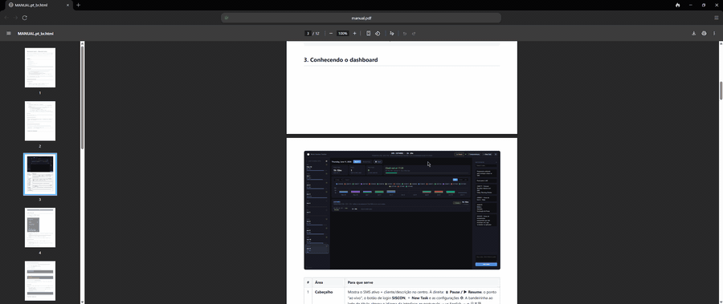

# nix

A directory alias manager for the command line. Give a project a short name once, then jump to it, search it, run commands in it, or move files in and out of it from any prompt — `o acme` and your shell is at the project root.

One TOML file holds every alias, one binary serves every command. State lives in `~/.nix` (`aliases.toml`, `groups.toml`, `config.toml`, usage data, and the segment / action / script files); override the location with `$NIX_HOME`.

## Demos

**Jump to any project.** `o acme` stacks a shell rooted at the alias directory; `o newproj C:\path` registers a new alias and jumps there in one step (the directory is auto-created).


**Search inside PDFs, office docs and archives.** `sg <alias> <pat> --all` runs the search with [ripgrep-all](https://github.com/phiresky/ripgrep-all) — matches found *inside* documents become individual, content-filterable fzf rows; pick one and it opens in your editor (text) or its default app (PDF).


**Clipboard → file from any prompt.** `p <alias> [name]` drops the clipboard into the alias directory — a screenshot saves as `.png`, text as `.md`, Explorer-copied files/folders copy in recursively — and copies the saved path back out.



## Install

### Windows (Scoop)

```powershell
scoop bucket add sadirano https://github.com/sadirano/bucket
scoop install nix
```

The Scoop package pulls in the tools the interactive commands lean on (`bat`, `fzf`, `ripgrep`, `fd`, `neovim`) and runs `nix --init` for you on install. `scoop update nix` tracks new releases; `scoop install sadirano/nix-nightly` tracks a daily build of `main` instead.

[Everything](https://www.voidtools.com/)'s `es` CLI is an optional extra (`scoop install everything-cli`): with it the `o <name>` picker gets instant, whole-system reach across every drive; without it the picker walks your drives with `fd` (tunable under `[picker]`).

### Prebuilt binaries

Each tagged release publishes a Windows `.zip` on the [Releases](https://github.com/sadirano/nix/releases) page — download, unpack, put `nix.exe` on your `PATH`, then run `nix --init`.

### Build from source

Requires [Zig 0.16+](https://ziglang.org/download/).

```powershell
zig build -Doptimize=ReleaseFast    # -> zig-out\bin\nix.exe
zig-out\bin\nix.exe --init
```

On Windows, prefer the portable build — a native build bakes the dev machine's CPU extensions into the binary and crashes with an illegal instruction on any machine lacking them:

```powershell
zig build -Doptimize=ReleaseFast -Dtarget=x86_64-windows -Dcpu=baseline
zig-out\bin\nix.exe --sync                 # deploy into ~/.nix/bin
```

(Both are saved as project actions in `.nix/actions.toml` — once the repo is registered as an alias, `r <alias> :build` and `r <alias> :sync` run them from anywhere.)

`nix --init` creates `~/.nix/`, installs the `.exe` command wrappers into `~/.nix/bin`, and adds that dir to your user PATH — restart your shell once and the short commands below are live in every shell (PowerShell, cmd, anything). It never touches your shell profile; the wrappers on PATH are the whole integration on Windows. (On Unix-likes a snippet written to `~/.nix/shell/` *is* the integration — shell functions that cd in place — so there you add the printed line to `.bashrc`/`.zshrc` yourself.)

One PowerShell gotcha: pwsh resolves aliases before PATH exes, and `r` is a built-in alias for `Invoke-History` — so of the eight commands it's the one pwsh silently shadows. Add `Remove-Item Alias:r -Force` to your `$PROFILE` (cmd and clink have no alias layer and are unaffected). Or sidestep it entirely: give the slot a second spelling with `[shortcuts]` — `r = ["r", "x"]` keeps `r` everywhere it already works and adds `x` for the shells that steal it.

## Use

```powershell
nix acme C:\Users\dev\projects\acme        # register an alias (auto-creates the dir if missing)
nix --force acme D:\moved\acme             # repoint an EXISTING alias (asks first without --force)
o acme                                     # jump to it
o acme C:\Users\dev\projects\acme          # register + jump in one step (dir auto-created)
o                                          # no args: open ~/.nix in your editor
e acme                                     # open it in your editor
s acme                                     # open it in Explorer
s acme report.pdf                          # open a file with its default app (PDF→viewer, .zip→archiver…)
s acme invoice                             # pick files (fzf) → open each with its default app
y acme                                     # print the path and copy it to the clipboard
y acme invoice                             # pick files (fzf) → copy the FILES to the clipboard
p acme                                     # save clipboard content into the alias dir, copy the saved path back
p acme shot                                # …with a name (image→shot.png, text→shot.md)
r acme zig build test                      # run a command at that path
sg acme TODO                               # ripgrep search under the dir → fzf → open the hit in your editor
sg acme invoice --all                      # search inside PDFs/office docs/archives too (ripgrep-all)
ff acme config                             # fuzzy-find files under the dir → fzf → open the selection
o docs@acme                                # jump to a sub-alias segment (see Sub-aliases below)
nix --list                                 # show every alias
nix --which                                # print the alias containing the cwd (reverse of resolve)
nix --edit                                 # open ~/.nix in your editor
nix acme --remove                          # forget the alias
```

An unknown name after `o` runs the directory picker (`es`/`fd` + fzf): pick a directory and it's registered and entered in one step.

**Repointing an existing alias asks first.** The alias file is the only record of where a name pointed, so overwriting one silently is how that path gets lost — a mistyped `o proj .` in the wrong directory, and the original is gone with nothing to restore it from. Registering the path an alias *already* has stays a silent no-op; changing it shows both paths and waits for `y`. Unattended (`--no-prompt`, or a pipe) it refuses rather than guessing, and `--force` is how a script says it meant it. Registration also refuses an argument that can't name a directory at all, so a stray token can't take an alias down with it.

On Windows every command is a standalone `.exe` wrapper, so they all work from any prompt with no shell glue; `o` stacks a new shell rooted at the target (with the project's `.nix/scripts` on PATH — exit it to land back where you were). On Unix-likes `o` is a shell function that cd's your current shell in place.

Clipboard fine print: `y <alias> <pat>` copies the picked files as a real file drop (Windows `CF_HDROP`; elsewhere it falls back to paths as text) — the inverse of `p`. `p` gives Explorer-copied files priority over text/image content (directories copy recursively), honours an explicit extension on `<name>`, and auto-increments on collision (`shot.png`, `shot-1.png`) so nothing is ever clobbered.

## Search and find

`sg` streams every ripgrep match into fzf as its own content-filterable row, with a live `bat` preview; Tab marks several, Enter opens the selection(s) in your editor at the matched line. `sg <alias> <pat> --all` (or `-a`) searches with [ripgrep-all](https://github.com/phiresky/ripgrep-all) (`rga`) instead, so matches reach **inside PDFs, office documents, archives, ebooks, and more** — the preview shows the extracted text, and a document hit opens in its default app (its "line" is really a page, not an editor position). Set `[grep] all = true` in `config.toml` to make `rga` the default for every `sg`.

`ff` shares the same fzf-with-preview picker, choosing its file lister by what's available — Everything's `es` on Windows, else `fd`, else `find`. Enter opens directories and default-app file types (PDF, images, archives, …) with the OS handler, everything else in your editor.

## Configuration

Aliases live in `~/.nix/aliases.toml`. The format is one TOML table per alias:

```toml
[acme]
path = "C:/Users/dev/projects/acme"
```

You can hand-edit the file (`nix --list` and resolve pick up changes immediately) or use `nix <name> <path>` to register and `nix <name> --remove` to forget. Alias lookups are case-insensitive. Names can't contain `/ \ @ + spaces` (each is reserved syntax) or the TOML metacharacters `[ ] = #` and quotes (they'd corrupt the stores).

Editor is taken from `$EDITOR`, then `$VISUAL`, then the first of `nvim`, `vim`, `code`, `nano`, or `notepad` found on PATH. Override the home location with `$NIX_HOME`.

`~/.nix/config.toml` holds the optional sections.

`[shortcuts]` renames the built-in command functions. The keys are the built-in names (`o`, `e`, `s`, `y`, `p`, `r`, `sg`, `ff`); the value is the name you'd rather type:

```toml
[shortcuts]
s = "show"     # type `show acme` instead of `s acme`
ff = "fzf"
```

Custom names follow the alias name rules (no spaces, separators, or TOML metacharacters) and can't be `nix` itself; an unusable rename is ignored and the slot keeps its built-in name.

A slot can also take **several names** — list them as an array, and each one gets its own wrapper:

```toml
[shortcuts]
r = ["r", "x"]   # keep `r`, add `x` — dodges pwsh's built-in `r` alias without retraining your hands
```

The first listed name is the primary (the one `--help` and the agent guide show). With a single string the rename *replaces* the letter; with an array, exactly the names you list answer — so `["r", "x"]` is how you say "both".

**Friendly names.** New to nix and the single letters feel cryptic? Rename every slot to the spelled-out word in one go. `ff` becomes `findfile` rather than `find`, so it never clashes with the built-in `find.exe`:

```toml
[shortcuts]
o  = "open"       # cd into the alias dir
e  = "edit"       # open the dir/file in your editor
s  = "show"       # open the dir in the file manager
y  = "yank"       # copy the path (or picked files)
p  = "paste"      # save the clipboard into the dir
r  = "run"        # run a command / saved action
sg = "search"     # ripgrep search under the dir
ff = "findfile"   # fuzzy-find files under the dir
```

These *replace* the letters (the renamed slot's short form stops answering); use the array form (`r = ["r", "run"]`) on any slot where you want both. The same preset ships commented out in the starter `config.toml`.

`[grep]` sets the `sg` default — `all = true` makes every search run `rga`; the per-run `--all`/`-a` flag flips a single search either way:

```toml
[grep]
all = true
```

`[bin]` sets how strict nix is about `~/.nix/bin` (see [Global tools](#global-tools-bin-exports)). `foreign = "purge"` deletes any file nix didn't install; the default `"warn"` only reports it:

```toml
[bin]
foreign = "purge"
```

`[picker]` filters the unknown-alias directory picker (Everything `es` + fzf), which `o` runs in-process when you navigate to a name that isn't an alias yet. By default it excludes any path component starting with `.`, `_`, or `[`, plus dependency/build/cache trees (`node_modules`, `site-packages`, `cache`, `bin`, `obj`, `build`, `dist`, …), the Windows system trees (`C:\Windows\`, `C:\Program Files`, `AppData`, …), and store-owned install trees (`scoop\apps`, `steamapps`) — so the result cap is spent on directories worth picking.

Setting `exclude` replaces the default list entirely (`exclude = []` turns filtering off); `exclude_extra` extends it — the place for machine-specific noise (TOML literal strings save the backslash-doubling):

```toml
[picker]
exclude_extra = ['\XboxGames\', '\Engine\']
```

Without a working `es` (not installed, or the Everything service isn't running), the picker falls back to walking a set of roots with `fd` (then POSIX `find`), listing directories whose path contains the typed name — a dead `es` falls through transparently. `search_roots` lists those roots (`~` is expanded); unset, it defaults to **every fixed drive** on Windows (your home directory elsewhere), pruning the OS trees so a whole-drive walk stays quick. Point it at the trees your projects actually live in to narrow and speed it up:

```toml
[picker]
search_roots = ['~/projects', 'D:\work']
```

After editing, run `nix --sync` and restart your shell to pick up renamed shortcuts or picker changes. On Windows `--sync` installs the wrapper exe under the new name and deletes the old builtin one, so the previous name stops answering.

## Sub-aliases (`@`-segments)

Append subdirectory shortcuts to any alias with `@`. Each segment is defined as a `[[contexts]]` entry, resolved by searching three places, first match wins:

1. **Per-alias, local:** `<alias-path>/.nix/segments.toml`
2. **Per-alias, central:** `~/.nix/segments/<alias>.toml`
3. **Global:** `~/.nix/segments.toml` — but only entries marked `scope = "global"` are visible here.

```powershell
o docs@acme              # cd into <acme-path>/documentation
e src@acme               # editor at <acme-path>/source
o tasks:432@acme         # inline value: cd into <acme-path>/tickets/432
o client:bob@projb       # multi-segment, innermost first
```

```toml
# ~/.nix/segments.toml — entries in the global file must opt in with scope = "global"
[[contexts]]
segment = "docs"
scope = "global"
source-template = "/documentation"   # leading `/` makes it a subdirectory

[[contexts]]
segment = "tasks"
scope = "global"
source-template = "/tickets/${tasks}"   # ${tasks} binds to the inline value
```

Per-alias files need **no** `scope` — every entry there is implicitly scoped to that alias. Only the shared global file requires the opt-in.

A segment resolves through its `source-template`: a string with `${VAR}` references. For each `${name}`, nix looks up, in order, (1) the segment's inline value (`seg:value`), bound under `${<segment>}` — or `${param}` if the context sets `param`; (2) variables a `run` source produced (see below); (3) the process environment; (4) the context's `[contexts.vars]` table, the last-resort default. Templates own their separators — `"/foo"` appends as a subdirectory, `"_${task}.md"` appends as a filename suffix.

Encountering an unknown segment defines it for you (seeded with a `[[contexts]]` skeleton in the central per-alias file). Lookups are case-insensitive, and `nix --contexts` prints the contexts defined in the global `~/.nix/segments.toml`.

### Context sources (`run`) — let a script decide the path

A context can compute its variables by running a script, so a path can depend on something you would otherwise have to look up and remember:

```toml
[[contexts]]
segment = "task"
run = "set_vars ${task}"                  # receives the inline value: 123
source-template = "/${client_name}/${task}"
cache = "1h"
```

```powershell
r task:123@project agent     # runs set_vars 123 -> client_name=acme
                             # cd <project>/acme/123, then runs `agent` there
```

Never having to remember which client ticket 123 belonged to is the point.

**The script's contract.** nix creates a temp file and puts its path in `$NIX_CONTEXT_OUT`; the script appends `KEY=VALUE` lines to it. Its **stdout is relayed to stderr** for you to read, never parsed, so a `.cmd` missing `@echo off` or a chatty tool it calls can't corrupt a variable. A non-zero exit aborts resolution and caches nothing. `NIX_SEGMENT`, `NIX_SEGMENT_VALUE`, `NIX_ALIAS`, and `NIX_ALIAS_PATH` are also set. Working samples for both shells: [`assets/samples/context-source/`](assets/samples/context-source/).

**`run` is a bare script name**, resolved like any project script — `<alias>/.nix/scripts/` first, then `~/.nix/scripts/`, extension-probed (`.cmd`/`.bat`/`.exe`/`.ps1`; `.ps1` is invoked through pwsh automatically). A name containing a path separator is taken relative to the alias dir. Tokens split *before* `${}` expands, so a value containing spaces stays one argument.

**Two variable phases.** The `run` line may only use the inline value, the environment, and `[contexts.vars]`. `source-template` may additionally use whatever the script returned. A `${client_name}` in the `run` line is an error — it doesn't exist yet. Both phases use the same precedence, so a name never means two different things.

**Overriding a default.** `[contexts.vars]` is the lowest-priority source, so `region=us-east o thing@proj` overrides one for a single command without touching config. The flip side: a stray variable left in your shell silently changes where you land, so keep `[contexts.vars]` names specific and avoid ones the OS already uses (`TEMP`, `USER`, `PATH`).

**Results are cached** on a hash of the fully expanded command line plus the script's contents, so `task:123` and `task:124` are separate entries and editing the script invalidates both. Set the lifetime per context with `cache` (`"30s"`, `"10m"`, `"2h"`, `"1d"`, a bare number of seconds, or `"0"` to run every time); the default is 10 minutes. An unparseable value falls back to the default rather than failing.

The cache lives in `~/.nix/contexts-cache.toml` and is safe to delete at any time. Two bounds keep it small: each entry is dropped once it outlives the TTL it was stored under, and the file is capped at **512 entries**, oldest evicted first. Every write rewrites the whole file, so the cap also bounds that cost.

### Named producers — one lookup, many projects

A `[[contexts]]` block does two unrelated jobs: *produce facts* (org-wide — "which client owns ticket 123" is the same question from every repo) and *shape a path* (project-local — one repo wants `client/123`, another wants `tickets/123-client`). Split them with a named producer and `uses`:

```toml
# ~/.nix/segments.toml — written once, by you
[[producers]]
name = "ticket"
run = "set_vars ${task}"
cache = "1h"
```

```toml
# <projA>/.nix/segments.toml            # <projB>/.nix/segments.toml
[[contexts]]                            [[contexts]]
segment = "task"                        segment = "task"
uses = "ticket"                         uses = "ticket"
source-template = "/${client_name}/${task}"   source-template = "/tickets/${task}-${client_name}"
```

`task:123@projA` lands in `projA/acme/123`; `task:123@projB` in `projB/tickets/123-acme`. One script wiring, two shapes.

The producer owns the command; the context supplies the values its `${}` references resolve against, so no parameter-passing mechanism is needed. A context's own `cache` overrides the producer's. An inline `run` wins over `uses`, so a command written on the context is never silently ignored. Producers merge by name across the same three files as contexts (project, central, global), nearest first — so a project can shadow a central lookup without editing it.

**The cache is shared.** Keyed on the expanded command line and script hash, not the alias — so asking about ticket 123 from `projA` and then `projB` is one lookup and one hit.

**A `uses` reference needs no approval.** A project file containing only `segment`, `uses`, and `source-template` is inert data: it can only invoke producers *you* declared, with values *you* typed, into a path `guardFragment` already fences. A repo shipping its own `[[producers]]` with a `run` line still goes through the ledger below.

**Executing needs approval.** A `.nix/segments.toml` travels with a `git clone`, so a `run` line declared outside `~/.nix` refuses to run until you approve it:

```powershell
nix --trust project task        # approve one segment
nix --trust project             # approve every source for the alias
```

The approval covers the exact bytes of **both** the declaring file and the script, so a later pull that rewrites either one asks again. Contexts whose declaration *and* script both live under `~/.nix` are yours already and need no approval.

## Groups (`+` multi-alias)

A **group** is a named set of aliases, kept in `~/.nix/groups.toml`. Use it to jump to several projects at once, or to fan a search/run/yank across all of them. Groups are referenced with the `+` sigil — and because of that, `+` is not allowed in alias names.

```powershell
o pa+work                # add alias `pa` to group `work` (creates it), then navigate
o +work                  # pick members in fzf: the first selection cd's the current
                         #   shell, each additional selection opens a new terminal
sg +work TODO            # ripgrep across every member's dir, into one fzf picker
                         #   rows read `member\rel\path`, not the absolute root
ff +work config          # fuzzy-find files across every member
r  +work git pull        # run a command in each member dir (per-dir header)
s  +work                 # open every member dir in the file manager
s  +work invoice         # pick files across every member → open with default apps
y  +work                 # copy every member path to the clipboard
y  +work invoice         # pick files across every member → copy the FILES
p  +work                 # pick ONE member (fzf) → paste the clipboard there
nix +work --resolve      # print every member path, one per line
nix --groups             # list all groups
nix +work --list         # list a group's members (each resolved to its path)
nix pa+work --remove     # drop a member
nix +work --remove       # delete the group
```

Members are **alias names**, resolved on use — move an alias and its groups follow; a member whose alias was removed is skipped with a note (and `nix <alias> --remove` strips it from every group). A group may contain another group as a `+other` member, expanded recursively (cycles and runaway nesting are guarded). The file is flat and hand-editable:

```toml
work = ["pa", "pb"]
all  = ["+work", "pc"]   # nested
```

When `o +group` opens more than one selection, the **first** keeps the current shell and the rest each launch a new terminal via `[nav] terminal` in `config.toml` — a command template with a `{dir}` placeholder. On Windows this defaults to `wt -d {dir}` (falling back to a `start` console window); elsewhere set it explicitly:

```toml
[nav]
terminal = "wezterm start --cwd {dir}"
```

## Per-alias actions

Save named commands per alias and run them from anywhere with `r <alias> :<name>` — like `package.json` scripts, but language-agnostic. Actions are plain shell strings (so `&&`, pipes, and redirects work), run in the alias directory.

```toml
# <alias-dir>/.nix/actions.toml   (commit it with the project)
[actions]
test   = "zig build test"
serve  = "npm run dev"

# Builds, then mirrors dist/ to the live host. Not reversible - it
# deletes anything on the target that isn't in dist/.
deploy = "./scripts/build.sh && rsync -a dist/ host:/srv"
```

**Descriptions come from the comment above an action.** The command says what runs; the comment says *why*, and listings show it in a DESCRIPTION column:

```
ACTION  COMMAND                                        DESCRIPTION
deploy  ./scripts/build.sh && rsync -a dist/ host:/srv  Builds, then mirrors dist/ to the live host. No...
serve   npm run dev
test    zig build test
```

There's no new syntax to learn: a run of `#` lines directly above an action is joined into one line of prose and becomes its description, so files that were already commented this way gain descriptions without being touched. A blank line between the comment and the action detaches it (that's how a file-header comment avoids describing the first action), a banner rule of dashes is never mistaken for prose, and the column only appears when something actually has one. `nix --actions` searches descriptions too — `nix --actions "not reversible"` finds the dangerous ones — and `--export`/`--import` carry them, so a `--replace` restore can't quietly drop them.

```powershell
r acme :test              # run acme's `test` action in acme's dir
r acme :                  # list acme's actions
r acme -o :serve          # start it in a window of its own and come straight back
r acme :test -- --json    # pass arguments through to the command
r acme :build :test       # a chain: in order, stopping at the first failure
r +work :test             # run each member's own `test` action (members without it are skipped)
```

**Arguments** are appended to the command, so `r acme :test -- --json` runs `zig build test --json`. The `--` is optional; it's there for when the argument would otherwise look like one of nix's own flags. If the command contains `{args}`, the arguments are substituted there instead of appended — for the ones whose arguments belong in the middle:

```toml
[actions]
serve = "npm run dev -- --port {args} --open"
```

Words are re-quoted as they were typed: `r acme :commit -- -m "two words"` reaches the shell with `"two words"` intact, as one word. Quotes written *in* the command survive too — nix builds the shell's command line itself rather than handing it to a layer that would rewrite every `"` as `\"`.

`-o` on an action now means what it always said: a real console window of its own, opened in the alias directory and left open so you can read it, with nix returning immediately. (On a literal command — `r acme -o some.exe` — `-o` still just starts the program detached and hands you back the prompt; that path is for launching apps, not for watching output.)

**Chains** run several actions in order, in this terminal, stopping at the first failure — the `&&` you would otherwise have typed, without naming the alias twice. Each link runs exactly as it would alone, under a `==> acme :test` header so the transcript can be read back. Arguments are refused for a chain (`r acme :build :test -- --release` has no honest answer to *which* action gets the flag): name one action, or pass none.

Actions resolve from three places, most specific winning: `<alias-dir>/.nix/actions.toml` (travels with the repo) overrides `~/.nix/actions/<alias>.toml` (private, per-machine), which overrides `~/.nix/actions/_default.toml` — **machine-wide defaults** for personal cross-project actions (`claude`, `git status`, …) defined once and available via `r <any-alias> :<name>` without leaking into committed repos (`_default` is reserved; it can't be registered as an alias). A leading `:` is what marks a saved action — without it, `r <alias> <cmd>` still runs `<cmd>` literally.

### Actions that need administrator rights

Write `sudo` in front of the command. That's the whole syntax:

```toml
[actions]
# Rebinds the service account. Needs admin.
install = "sudo .\\scripts\\install-service.ps1"
```

`r acme :install` raises a UAC prompt and, once you accept, runs the command in an **elevated console of its own** — elevation hands back a process under a different token, and that process cannot write into this terminal, so pretending otherwise would just lose the output. The window opens in the alias directory and stays open so you can read it; nix reports `started acme :install (elevated)` and returns immediately. There's no exit code to wait for and no `[notify]` hook, for the same reason `--outside` has neither.

The marker has to be the first word — it elevates the command, not one link of a `&&` chain — and it survives into listings, so `r acme :` and the palette both show which actions will prompt. Since the elevated shell is the administrator's session, not yours, nix writes the alias context (`NIX_ALIAS`, `NIX_ALIAS_PATH`, and the `.nix/scripts` directories *prepended* to the admin's `PATH`) into the command as a `set` prelude. Answering "No" to UAC is reported as `elevation declined - nothing was run`. On non-Windows nothing is intercepted: there `sudo` is a real program and the line runs as written.

**An elevated action asks every time**, and there is no way to remember the answer. UAC does show a dialog, but it names the *shell* — `cmd.exe` — not the command line it was handed, so it can't tell you what you are agreeing to. This prompt is the only place that text is ever displayed:

```
nix: :install will run as ADMINISTRATOR:
  sudo .\scripts\install-service.ps1
Run it elevated? [y/N]
```

A remembered "yes" would mean an administrator command line nobody has read since the day it was approved, which is exactly the thing worth reading. Unattended — piped, redirected, or under `--no-prompt` — an elevated action refuses rather than running; it could never have answered UAC anyway.

### Actions that arrived with a clone

A project's `.nix/actions.toml` is committed, which means `git clone` brings it with the code, and `r acme :build` would run whatever it says. Choosing the *name* is not consent to the *command*. So the first run of a file nix hasn't seen approved shows what it is about to run:

```
nix: acme's :ship wants to run:
  python tools/deploy.py --prod
  declared in C:\code\acme\.nix\actions.toml
  runs         C:\code\acme\tools\deploy.py
Approve these files as they stand, and run? [y/N/e=open in editor]
```

**The command is rarely the whole story**, so the prompt names the project files it runs, and `e` opens all of them in your editor before you answer. A one-line command invoking a Python file tells you nothing about what that file does, and a prompt answerable only from the summary trains you to approve summaries. (A GUI editor hands control back immediately rather than when you close the window, so the question returns while the file is still open — nix names the editor it launched instead of pretending it can tell when you've finished reading.)

Those referenced files are part of the approval, not just the display: editing `deploy.py` re-arms the gate even though `actions.toml` never changed. The detection is deliberately shallow, and worth knowing precisely — it sees what the *command line* names, not what those files then call, so a script invoking a second script is one level beyond it. Only files inside the project count; an absolute path or a `..` escape is ignored. And only **reviewable source** counts — `.py`, `.sh`, `.ps1`, `.cmd`, `.js` and friends. Compiled output is excluded on purpose: this repo's own `sync` action runs `zig-out\bin\nix.exe`, and hashing that would re-arm approval on every rebuild, which is precisely how someone learns to hit `y` without looking.

Approving records those files' **current bytes**, so it runs silently from then on — until a `git pull` rewrites any of them, which re-arms the prompt. That's the same hash discipline context sources and `[bin]` exports already use: what you approved is the text you read, not the filename. `nix --trust <alias>` approves an alias's actions, its `.nix/scripts`, and its context sources in one gesture, which is the sane way to take on a fresh clone; `nix --doctor` lists which aliases are still waiting.

Only the layer that travels is gated. `~/.nix/actions/<alias>.toml`, `_default.toml`, `~/.nix/scripts`, a project that lives under `~/.nix`, and anything you type as a literal command (`r acme git status`) run untouched — they're under your home directory or you wrote them just now, and there the provenance is you. Scripts get the same treatment as the actions file beside them, since gating `:build` while leaving `r acme build` open would only move the unreviewed code one filename over.

**Nothing can approve on your behalf.** Under `--no-prompt`, a pipe, or the palette's parallel fan-out (which has no terminal to ask in), the gate refuses and prints the `--trust` line instead. That's deliberate: an agent approving a repo it just cloned is the check approving itself.

### Failures don't vanish from a shortcut

Pin `r nix :build :sync` to the Start menu and Windows makes a console for it, then destroys that console the moment nix exits — so a failure prints its message and disappears in the same instant. When nix is the **only** process attached to its console, it knows the window is about to go with it, and waits:

```
nix: :build failed (exit 1) - stopping

(this window was opened for nix and would close now - press Enter)
```

Launched from a shell you already had open, nothing happens: the shell is attached too, the window outlives nix, the error is still on screen, and stopping would just be in the way. That distinction — `GetConsoleProcessList` reporting exactly one process — is what lets this be the default instead of a flag you'd have to remember on the one run that fails.

It's at nix's single exit point rather than per action, so a failing chain, a `--deps` abort, an unapproved action and a plain `unknown alias` all hold alike; from a shortcut each one is a window that blinks and is gone. Success never holds — there's nothing to read.

Three things switch it off, each a case where holding would be wrong rather than merely unwanted: `--no-prompt` (the caller has declared that nothing may block), a stdin that isn't a console (a pipe answers instantly, so the hold would be a no-op that printed a confusing line), and a shared console. If you want to hold on *success* too — to read a build log you're about to overwrite — end the chain with a `:pause` action from `~/.nix/actions/_default.toml`, or launch through `cmd /k`.

### Building on other repos (`[deps]`)

A group fans out over a *set*; a multi-repo build needs an *order*. Declare what a project builds on, and one command builds the world under it — with every repo keeping its own build definition:

```toml
# acme/.nix/actions.toml
[deps]
needs = ["hoot", "libx"]
```

```powershell
r acme --deps :build      # hoot's :build, then libx's, then acme's
```

Each dependency runs **its own** action of that name, so nothing here says how to build anything — the graph only says what comes first. Members are alias names, not paths, so the graph follows a repo when it moves. The walk is depth-first, and a diamond (two dependencies sharing a third) builds the shared one once, early enough for both.

It is **strict, and strict before it starts.** A `needs` naming an unregistered alias, or a dependency that doesn't define the action, aborts the whole chain with nothing run — reported all at once, so you fix the graph in one pass rather than discovering the fourth gap after three builds. A failure mid-chain stops the rest and keeps its exit code:

```
==> hoot :build
...
nix: hoot :build failed (exit 3) - stopping
```

That strictness is the difference from a group, deliberately. `r +work git pull` should keep going when one member is offline; a build chain *is* its completeness, and half a world built is worse than none because it looks like success. Plain `r acme :build` is untouched — dependencies run only when asked.

### The palette (`nix --actions`)

Actions are declared per alias but invoked from anywhere, so the thing you forget is rarely the command — it's *which alias owns it*. `nix --actions` (`-A`) gathers every alias's actions into one fzf view and runs the pick in its own directory:

```powershell
r :                              # the shorthand: any nix command + a bare `:`
nix --actions                    # pick from everything wired up on this machine
nix --actions deploy             # pre-filter by alias, action name, or command text
nix --no-prompt --actions        # just print the table, run nothing
```

```
ALIAS  ACTION    COMMAND                           DESCRIPTION
acme   :build    zig build -Doptimize=ReleaseFast  Portable build: no native CPU extensions baked in.
acme   :test     zig build test
beta   :deploy   npm run deploy && echo shipped
```

Enter runs the pick exactly as `r <alias> :<name>` would — same three-layer merge, same directory, so `[notify]` hooks and usage recording apply and the palette can never disagree with what `r` would run. The pattern is a plain case-insensitive substring across every column, not a fuzzy match; fzf is still there to narrow further. Machine-wide `_default` actions are deliberately left out: the palette is a map of deliberate per-project wiring, and a default would otherwise repeat under every alias (they stay reachable as `r <any-alias> :<name>`).

**A bare `:` is the shortest way in**, from any command: `r :`, `o :`, `nix :` all open the palette, and anything after it pre-filters (`r : deploy`). It's the alias-less form of `r <alias> :` — the same colon, one scope wider: with an alias in front it lists that project's actions, without one it lists every project's. Nothing was given up to allow it, since `:` was never a legal alias name.

**Mark several with Tab and they all start, in parallel, each in a window of its own.** Two actions can't share one terminal — the output would interleave and only one of them could read the keyboard — so a multi-pick fans out into a new shell per action (a new console on Windows, opened in that action's directory with its `NIX_ALIAS` and scripts on `PATH`) and nix returns immediately. Build three projects, or bring up a server and its worker, from one picker:

```
started acme :build
started beta :deploy
```

The single pick is unchanged: one action still runs right here, in the foreground, with its `[notify]` hook. A fan-out has no finish for nix to observe, so it reports only that everything started — the windows are where you watch them.

### Completion notifications

Long actions launched via `r` finish silently — and `long-cmd && notify` misses the one case that most deserves a notification (failure). Set a `[notify] on_finish` hook in `~/.nix/config.toml` and **every** foreground `:action` reports its outcome through it, single runs and `r +group :build` fan-outs alike:

```toml
[notify]
on_finish = 'hoot send "{message}" --tag {alias} --level {level}'
```

The template runs in the alias dir after the action exits, with placeholders expanded: `{alias}`, `{action}`, `{exit}`, `{status}` (`ok`/`fail`), `{duration}` (`850ms`, `12s`, `1m23s`), `{level}` (`info` on success, `warn` on failure — so a level-aware notifier keeps success quiet and toasts failure), and `{message}` (a composed one-liner, e.g. `:build failed (exit 2) after 1m23s`). Like `[nav] terminal`, it's tokenized and spawned directly rather than through a shell, and expansion happens per token — so a bare `{message}` stays a single argument, quoted or not; prefix `cmd /c` (or `sh -c '…'`) if you really want shell operators. The hook also sees `NIX_ALIAS`, `NIX_ACTION`, `NIX_ACTION_EXIT`, and `NIX_ACTION_DURATION_MS` in its environment, so it can just as well be a bare script name from `.nix/scripts`. It's an observer only: its own exit code is ignored and the action's is passed through untouched. Detached runs (`r <alias> -o :serve`) and literal commands (`r <alias> <cmd>`) don't notify — the hook is for the named, repeatable things.

Two sibling keys record what the clipboard commands actually did, for the "wait, what exactly did that copy?" moments — no more re-checking:

```toml
[notify]
on_paste = 'hoot send "{message}" --tag {alias}'   # pasted image D:/temp/2026-07-17.png · pasted 3 files into …
on_yank  = 'hoot send "{message}" --tag {alias}'   # yanked path C:/work/acme · yanked 2 files
```

They fire only on success (a failed `p`/`y` already has your eyes on it) with `{alias}`, `{message}`, `{status}` (`ok`), and `{level}` (`info`) — quiet log entries, never toasts, made to be read back later from the notifier's inbox.

For full scripts rather than one-liners, drop an executable in the alias's `.nix/scripts/` (or the central `~/.nix/scripts/`) and run it by bare name — `r acme build` runs `<acme>/.nix/scripts/build.cmd`. The scripts dir is put on `PATH` in any alias context, so a project `build` shadows a global one, scripts can call each other, and — best of all — **inside an `o acme` shell the project's own `build`/`clean`/… just work as commands**, with no global versions and scoped to that shell (exit it and they're gone). It fans out too: `r +work build` runs each member's own script. Project-local first, then central; on Windows the extension (`.cmd`/`.bat`/`.exe`/`.ps1`) is resolved for you.

## Notes (`--note` / `nix --notes`)

Re-entering a project costs more than finding the directory. The expensive part is remembering where you left off, and no amount of navigation speed helps with that. So every alias gets a freeform markdown file:

```powershell
nix acme --note blocked on the API key, resume at segments.zig
nix +work --note whole workstream is waiting on procurement
nix acme --note                  # no text: open the file in your editor
nix --notes                      # search every project's notes at once
nix --notes procurement          # ...or jump straight to one
```

Text is joined from the remaining words, so quoting is never needed — the point is capturing a thought in the time it takes to type it. Each capture appends a dated bullet, seconds included, because two notes in the same minute is the normal case when you're working through something:

```markdown
- 2026-07-26 23:45:05 - blocked on the API key, resume at segments.zig
- 2026-07-26 23:47:30 - key arrived, segments.zig green, next is the cache TTL
```

`nix --notes` (`-N`) is the `sg` pipeline pointed at the notes directory, so rows arrive as `acme.md:12:- 2026-07-26 …` — **the filename is the alias**, which is what makes a cross-project view readable without a header. Enter opens your editor on that exact line, Tab marks several, and `--no-prompt` prints the rows and opens nothing. With no pattern you get every line.

**They live in `~/.nix/notes/`, not in your repos**, and that's the whole design rather than an implementation detail. A project-local notes file has to be either committed — publishing your private half-thoughts — or gitignored, and an ignored file is precisely what `git clean -fdx` deletes. Central files survive `clean`, a re-clone, and deleting the project; they give groups a home at all (a group has no directory); they can't diverge across two clones of one remote; `--notes` stays complete when a project drive is unplugged; and a cloned repo can never ship you notes it wrote.

Notes are yours throughout: created on first use, never trust-gated (they're under your home directory and you wrote them), and **never deleted by nix**. `nix acme --remove` drops the alias and leaves the note; `nix --doctor` then reports it as an orphan rather than tidying it away, because a stale note is a much smaller problem than a deleted one.

## Global tools (`[bin]` exports)

A tool you build in one aliased project usually wants to be runnable from every other one — without hardcoding absolute paths at call sites or dumping it into some PATH folder that slowly rots. Declare it in the project's committed `.nix/actions.toml`:

```toml
[bin]
hoot = "zig-out/bin/hoot.exe"
gw   = "scripts/gw.cmd"
```

`nix --sync-bin` materializes the exports into `~/.nix/bin` — which nix already keeps on your PATH — so `hoot` becomes a global command with **zero PATH edits**. Exes are copied (the installed copy keeps working while you rebuild the source); `.cmd`/`.bat` get a one-line forwarder so script edits take effect live, and `.ps1` gets a `.cmd` trampoline (via `pwsh`, or `powershell` when pwsh isn't installed) so it launches from any shell, not just PowerShell. Rebuilt an exe? Re-run the sync (or append `&& nix --sync-bin` to the project's `:build` action).

Putting a binary on your PATH is always an explicit act, **per version**. `nix --sync` never installs on your behalf: a name it hasn't seen before, *and* a version whose source changed since you last allowed it, are only listed for review — you run `nix --sync-bin` to allow them. So registering an alias for someone else's repo never puts a command on PATH as a side effect of routine syncing, and a tool you use can't silently swap to a freshly-built binary underneath you. (The fingerprint that makes this work is a content hash recorded next to each export in the manifest.) And since an export can shadow a tool you already have (a scoop shim, a system binary), the sync warns whenever an export name also resolves elsewhere on PATH — legitimate when it's your own build overriding a packaged one, but never a surprise.

Membership is declarative, so the bin can't rot: every installed file is recorded in `~/.nix/exports.toml` with its owning alias and content hash, removing the `[bin]` line (or the alias) removes the file on the next sync, and a name claimed by two aliases is refused loudly — nobody wins until one renames. Wrapper names (`o`, `r`, `nix`, …) and DOS device names (`nul`, `con`, …) are reserved. An alias whose directory is merely *unreachable* (unplugged drive, network share down) keeps its exports installed — unknown is not undeclared; only removing the alias or the `[bin]` line uninstalls.

`~/.nix/bin` is nix-managed territory: **don't edit or drop files into it by hand.** An export you hand-edit in place is detected (its bytes no longer match the version you allowed, while the source is unchanged) and **restored** to the allowed version on the next sync, with a warning. For a file nix never installed, the `[bin]` config decides how strict to be:

```toml
[bin]
foreign = "warn"    # default: report it in --sync/--doctor, but never delete it
# foreign = "purge" # delete anything in ~/.nix/bin that nix didn't install
```

`nix --doctor` reports the full picture: an export whose alias or source is gone, a new version awaiting your OK, an export edited in place, a declared export not yet installed, and any foreign file in `~/.nix/bin`.

## Tab completion

On Unix-likes, every command that takes an alias (`o`, `e`, `s`, `y`, `p`, `r`, `sg`, `ff`) supports bash/zsh tab-completion of alias names via the `~/.nix/shell/nix.sh` snippet. The completer calls `nix --list-names` under the hood — a dedicated path that bypasses TOML parsing so Tab stays instant.

On Windows there is no completion (and no shell snippet): the commands are plain `.exe`s on PATH and work in any shell as-is. Earlier versions generated `~/.nix/shell/nix.ps1` for PowerShell completion plus a `q` (exit) helper; `--sync` removes that retired file — if you used `q`, add `function q { exit }` to your `$PROFILE`.

## AI agents

`nix --init` also writes `~/.nix/AGENTS.md`, a short guide that teaches coding agents your command surface — so they say "run it with `r acme :test`" instead of quoting absolute paths, register repeatable commands as actions, and know to resolve with `nix <alias>` rather than `o` in their own non-interactive shells. `nix --sync` regenerates it, so the guide always shows your effective `[shortcuts]` names.

nix never registers the file with any agent itself — wiring it up is a deliberate, per-user step. For Claude Code, import it from your global memory file, `~/.claude/CLAUDE.md`:

    @~/.nix/AGENTS.md

Other tools can point at the same file wherever they take custom instructions.

## Commands

`nix --init` (covered under Install) is idempotent — re-run it any time. `nix --sync` regenerates the agent guide and the command wrappers (plus the shell snippet on Unix-likes) after you move the binary or edit `config.toml`. `nix --version` prints the build version and OS/arch. `nix --help` lists everything.

`nix --prune` cleans a crusty alias list: an fzf multi-select of every alias ranked prune-first — dead targets (directory gone), then never-used, then least-recently used. Tab marks, Enter removes the marked aliases, Esc cancels; `--no-prompt` just prints the ranking. The ranking comes from `~/.nix/usage`, a small file the resolve paths maintain automatically (debounced to at most one write per alias per hour; delete it any time to start fresh). Group fan-outs are charged to the group itself — a `+name` key in the same file — never to the members, so an alias's own frecency only moves when you use it directly. Prune still won't ambush you: members of a recently used group inherit its recency in the ranking, marked `(via +group)`, so an alias you only ever reach through `r +work …` doesn't rank as never-used.

`nix --sweep` finds picker noise you didn't think of: it scans the whole Everything index for directories with 100+ unfiltered subfolders (`--min N` tunes the threshold) and offers the worst offenders in an fzf multi-select. Enter appends the marked subtrees to `~/.nix/picker.swept` (a third exclusion layer, one fragment per line); `--no-prompt` just prints the ranking. Directories containing a registered alias target are never offered.

`nix --export [file]` writes a portable backup of your aliases, groups, `config.toml`, and central per-alias actions as one TOML document (to stdout when no file is given; the machine-local `usage` ranking is left out). `nix --import <file>` restores one: by default it **merges**, adding only alias/group/action names you don't already have and never overwriting your `config.toml`, so re-importing is safe. `nix --import <file> --replace` does a deliberate full restore instead — aliases, groups, and config are replaced from the file, and each alias's central actions file is overwritten. Together they cover backup, moving your setup to a new machine, and recovering after a `~/.nix` mishap.

`nix --doctor` (`-D`) is a read-only health check for when the `o <name>` picker misbehaves: build and wrapper state (stale wrappers, `~/.nix/bin` missing from PATH), which finder the picker will actually use and why, the resolved search roots, the optional tools (`bat`/`rg`/`rga`/editor), your config/alias state, and `[bin]` export drift. It exits non-zero if any core check fails, so `nix --doctor && …` works in scripts.

`nix --which [path]` (`-w`) is resolve in reverse: it prints the alias whose directory contains the path (default: the current directory), deepest registered dir winning — made for prompts and status-line scripts that want to show "where am I, in alias terms". It's strictly read-only (no usage recording, no dir creation) and exits non-zero with empty stdout when no alias contains the path, so it's cheap and safe to poll. Often you don't even need it: every alias context nix starts — the `o <alias>` subshell, `r <alias> <cmd>`, a `:action`, group fan-outs — already carries `NIX_ALIAS` (the alias name) and `NIX_ALIAS_PATH` (its directory) in the environment, computed once at launch.

## License

MIT.
