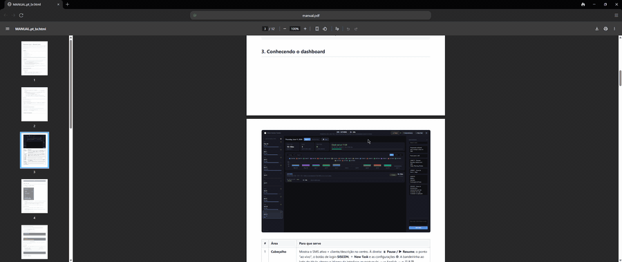

# nix

A directory alias manager for the command line. Give a project a short name once, then jump to it, search it, run commands in it, or move files in and out of it from any prompt — `o acme` and your shell is at the project root.

One TOML file holds every alias, one binary serves every command. State lives in `~/.nix` (`aliases.toml`, `config.toml`, usage data, and the segment / action / script files); override the location with `$NIX_HOME`.

New to nix? **[The Guide](docs/GUIDE.md)** walks through every use, from the daily one-letter commands to complete workflows; this README is the reference behind it.

## Demos

**Jump to any project.** `o acme` stacks a shell rooted at the alias directory; `o newproj C:\path` registers a new alias and jumps there in one step (if the directory does not exist, nix asks before creating it - Enter says yes).


**Search inside PDFs, office docs and archives.** `g <alias> <pat> --all` runs the search with [ripgrep-all](https://github.com/phiresky/ripgrep-all) — matches found *inside* documents become individual, content-filterable fzf rows; pick one and it opens in your editor (text) or its default app (PDF).


**Clipboard → file from any prompt.** `p <alias> [name]` drops the clipboard into the alias directory — a screenshot saves as `.png`, text as `.md`, Explorer-copied files/folders copy in recursively — and copies the saved path back out.



## Install

### Windows (Scoop)

```powershell
scoop bucket add sadirano https://github.com/sadirano/bucket
scoop install nix
```

The Scoop package pulls in the tools the interactive commands lean on (`bat`, `fzf`, `ripgrep`, `fd`, `neovim`) and runs `nix --init` for you on install. `scoop update nix` tracks new releases; `scoop install sadirano/nix-nightly` tracks a daily build of `main` instead.

[Everything](https://www.voidtools.com/)'s `es` CLI is an optional extra (`scoop install everything-cli`): with it the `o <name>` picker gets instant, whole-system reach across every drive; without it the picker walks your drives with `fd` (tunable under `[picker]`).

### Prebuilt binaries

Each tagged release publishes a Windows `.zip` on the [Releases](https://github.com/sadirano/nix/releases) page — download, unpack, put `nix.exe` on your `PATH`, then run `nix --init`.

**Prefer Scoop if you can.** The binaries are unsigned, and a browser download of an unsigned `.zip` is what antivirus scanners weigh hardest; installing through Scoop avoids that path, verifies the published hash for you, and makes `scoop update nix` the way you get the next version. Releases are built entirely in public CI on GitHub-hosted runners by [`.github/workflows/release.yml`](.github/workflows/release.yml), with every build's log public under [Actions](https://github.com/sadirano/nix/actions) — or skip binaries altogether and build it yourself, which is one command.

### Build from source

Requires [Zig 0.16+](https://ziglang.org/download/).

```powershell
zig build -Doptimize=ReleaseFast    # -> zig-out\bin\nix.exe
zig-out\bin\nix.exe --init
```

On Windows, prefer the portable build — a native build bakes the dev machine's CPU extensions into the binary and crashes with an illegal instruction on any machine lacking them:

```powershell
zig build -Doptimize=ReleaseFast -Dtarget=x86_64-windows -Dcpu=baseline
zig-out\bin\nix.exe --sync                 # deploy into ~/.nix/bin
```

(Both steps are one project action in `.nix/actions.toml` — once the repo is registered as an alias, `x <alias> :deploy` runs them from anywhere.)

`nix --init` creates `~/.nix/`, installs the `.exe` command wrappers into `~/.nix/bin`, and adds that dir to your user PATH — restart your shell once and the short commands below are live in every shell (PowerShell, cmd, anything). It never touches your shell profile; the wrappers on PATH are the whole integration on Windows. (On Unix-likes a snippet written to `~/.nix/shell/` *is* the integration — shell functions that cd in place — so there you add the printed line to `.bashrc`/`.zshrc` yourself.)

The run command is `x`, not `r`, for a PowerShell reason: pwsh resolves aliases before PATH exes, and `r` is its built-in alias for `Invoke-History` — so `r` was the one command the shell silently shadowed. `x` is free in every shell. If your hands already know `r`, give the slot both spellings with `[shortcuts]` — `x = ["x", "r"]` — and add `Remove-Item Alias:r -Force` to your `$PROFILE` so pwsh stops answering first.

## Use

```powershell
nix acme C:\Users\dev\projects\acme        # register an alias (asks before creating a missing dir)
o acme                                     # jump to it
o acme C:\Users\dev\projects\acme          # register + jump in one step
o                                          # no args: open ~/.nix in your editor
e acme                                     # open it in your editor
s acme                                     # open it in Explorer
s acme report.pdf                          # open a file with its default app (PDF→viewer, .zip→archiver…)
s acme invoice                             # pick files (fzf) → open each with its default app
y acme                                     # print the path and copy it to the clipboard
y acme invoice                             # pick files (fzf) → copy the FILES to the clipboard
p acme                                     # save clipboard content into the alias dir, copy the saved path back
p acme shot                                # …with a name (image→shot.png, text→shot.md)
x acme zig build test                      # run a command at that path
g acme TODO                                # ripgrep search under the dir → fzf → open the hit in your editor
g acme invoice --all                       # search inside PDFs/office docs/archives too (ripgrep-all)
f acme config                              # fuzzy-find files under the dir → fzf → open the selection
n acme blocked on the API key              # capture a note (n acme reads them back)
q                                          # close this shell (see below)
o docs@acme                                # jump to a sub-alias segment (see Sub-aliases below)
nix acme --env                             # what the project's .nix/env.toml sets, and where each value came from
nix --list                                 # show every alias
nix --which                                # print the alias containing the cwd (reverse of resolve)
nix --edit                                 # open ~/.nix in your editor
nix acme --remove                          # forget the alias
```

An unknown name after `o` runs the directory picker (`es`/`fd` + fzf): pick a directory and it's registered and entered in one step.

**Repointing an existing alias asks first.** The alias file is the only record of where a name pointed, so overwriting one silently is how that path gets lost — a mistyped `o proj .` in the wrong directory, and the original is gone with nothing to restore it from. Registering the path an alias *already* has stays a silent no-op; changing it shows both paths and waits for `y`. Unattended (`--no-prompt`, or a pipe) it refuses rather than guessing; `nix <alias> --remove` first is how a script says it meant it. Registration also refuses an argument that can't name a directory at all, so a stray token can't take an alias down with it.

On Windows every command is a standalone `.exe` wrapper, so they all work from any prompt with no shell glue; `o` stacks a new shell rooted at the target (with the project's `.nix/scripts` on PATH — exit it to land back where you were). On Unix-likes `o` is a shell function that cd's your current shell in place.

Clipboard fine print: `y <alias> <pat>` copies the picked files as a real file drop (Windows `CF_HDROP`; elsewhere it falls back to paths as text) — the inverse of `p`. `p` gives Explorer-copied files priority over text/image content (directories copy recursively), honours an explicit extension on `<name>`, and auto-increments on collision (`shot.png`, `shot-1.png`) so nothing is ever clobbered.

## Search and find

`g` streams every ripgrep match into fzf as its own content-filterable row, with a live `bat` preview; Tab marks several, Enter opens the selection(s) in your editor at the matched line. `g <alias> <pat> --all` (or `-a`) searches with [ripgrep-all](https://github.com/phiresky/ripgrep-all) (`rga`) instead, so matches reach **inside PDFs, office documents, archives, ebooks, and more** — the preview shows the extracted text, and a document hit opens in its default app (its "line" is really a page, not an editor position). Set `[grep] all = true` in `config.toml` to make `rga` the default for every `g`.

`f` shares the same fzf-with-preview picker, choosing its file lister by what's available — Everything's `es` on Windows, else `fd`, else `find`. Enter opens directories and default-app file types (PDF, images, archives, …) with the OS handler, everything else in your editor.

**A native picker, no fzf needed.** Every picker nix opens (`f`, `g`, `s`/`y` with a pattern, the unknown-alias picker, `nix --actions`, segment menus) can use [glean](https://github.com/sadirano/glean) instead: an fzf-style picker compiled into nix, with fzf's query syntax, ranking and look, so no external process is started. Turn it on in `config.toml`:

```toml
[picker]
engine = "native"   # default "fzf"
```

The native engine is Windows-only for now (elsewhere fzf stays the engine), shows rows without colour, and prints rather than opens when nobody is at a console, as `--no-prompt` does. `nix --doctor` reports which engine is in use.

## Closing the shell (`q`)

`q` closes the shell you typed it in. It's the one command that takes no alias: a child process can't make its parent return from a prompt — `exit` inside a command exits that command's own shell and nothing else — so ending the shell that ran you means terminating it.

Which is exactly why it checks first. `q` refuses unless the process above it really is a shell (`cmd`, `powershell`, `pwsh`, `bash`, `sh`, `zsh`, `fish`, `nu`): started from Windows Terminal, an IDE, or a `.lnk`, the process above can be the terminal host itself, and closing *that* takes every other tab down with it. It also refuses when the parent is already gone — a pid is reused the moment its process ends, and a "parent" that started *after* you is somebody else holding the number. `q --dry-run` names the target and touches nothing.

It's a hard kill, so a shell holding unflushed state (clink's history, for one) can lose it. Windows-only: on a POSIX shell, nix's integration is a shell function and `exit` already does this properly.

## Configuration

Aliases live in `~/.nix/aliases.toml`. The format is one TOML table per alias:

```toml
[acme]
path = "C:/Users/dev/projects/acme"
```

You can hand-edit the file (`nix --list` and resolve pick up changes immediately) or use `nix <name> <path>` to register and `nix <name> --remove` to forget. Alias lookups are case-insensitive. Names can't contain `/ \ @ + spaces` (each is reserved syntax) or the TOML metacharacters `[ ] = #` and quotes (they'd corrupt the stores).

One alias is always there: **`.nix` names nix's own home**, so nix's own files are reachable without an absolute path — `e .nix config.toml`, `g .nix TODO`, `nix .nix --run <cmd>` to run something *at* that directory. It's built in rather than registered (`nix --list` marks it `(built-in)`), so it can't be repointed or lost when the home moves; `nix .nix <path>` is refused. It works anywhere an alias does. `.nix` is the only reserved dotted name — `.nixrc` and friends register normally.

### Time per project

nix already waits for the things worth measuring — an `o` session until its subshell exits, a foreground `x` until the command returns — so each one writes a line to `~/.nix/time`: alias, start, duration, and which of the three it was (`session`, `run`, `action`). No tracker to remember to start, nothing to sign into, nothing leaving the machine.

The ledger is plain text for your own reports to read; nix writes it and never displays it. Detached (`--outside`) and elevated runs record nothing: nix returns as soon as the window is up, so there is no finish to observe.

It is measurement, never inference. A shell left open overnight is logged at its real fourteen hours and marked `*`, with the total given both with and without it — a cap would be tidier and would record a session nobody had. Like `usage`, the ledger is machine-local.

### Path dialects

`--as <dialect>` changes the *spelling* of the path a command prints or copies - the same directory, written the way whichever tool is about to read it expects:

| dialect | example |
|---|---|
| `win` | `C:\acme\src` |
| `slash` | `C:/acme/src` |
| `gitbash` | `/c/acme/src` |
| `wsl` | `/mnt/c/acme/src` |
| `uri` | `file:///C:/acme/src` |

Accepted by the resolve form (`nix acme --as wsl`) and by `y` (`y acme --as gitbash` copies the translation). `o` refuses it - it enters the directory rather than printing one, so a respelled path there would break navigation instead of respelling it. A patterned `y` with `--as` copies text rather than a file drop, since Explorer has no use for `/mnt/c/...`.

Pure string translation, no filesystem check, so a path that does not exist yet translates exactly like one that does. A UNC share has a `uri` form and no wsl/gitbash form; those refuse rather than guess a mount point.

Editor is taken from `$EDITOR`, then `$VISUAL`, then the first of `nvim`, `vim`, `code`, `nano`, or `notepad` found on PATH. Override the home location with `$NIX_HOME`.

`~/.nix/config.toml` holds the optional sections.

`[shortcuts]` renames the built-in command functions. The keys are the built-in names (`o`, `e`, `s`, `y`, `p`, `x`, `g`, `f`, `q`); the value is the name you'd rather type:

```toml
[shortcuts]
s = "show"     # type `show acme` instead of `s acme`
f = "fzf"
```

Custom names follow the alias name rules (no spaces, separators, or TOML metacharacters) and can't be `nix` itself; an unusable rename is ignored and the slot keeps its built-in name.

A slot can also take **several names** — list them as an array, and each one gets its own wrapper:

```toml
[shortcuts]
x = ["x", "r"]   # keep `x`, add back `r` — the spelling the run command used to have
```

The first listed name is the primary (the one `--help` and the agent guide show). With a single string the rename *replaces* the letter; with an array, exactly the names you list answer — so `["x", "r"]` is how you say "both".

**Friendly names.** New to nix and the single letters feel cryptic? Rename every slot to the spelled-out word in one go. `f` becomes `findfile` rather than `find`, so it never clashes with the built-in `find.exe`:

```toml
[shortcuts]
o  = "open"       # cd into the alias dir
e  = "edit"       # open the dir/file in your editor
s  = "show"       # open the dir in the file manager
y  = "yank"       # copy the path (or picked files)
p  = "paste"      # save the clipboard into the dir
x  = "run"        # run a command / saved action
g  = "search"     # ripgrep search under the dir
f  = "findfile"   # fuzzy-find files under the dir
```

These *replace* the letters (the renamed slot's short form stops answering); use the array form (`x = ["x", "run"]`) on any slot where you want both. The same preset ships commented out in the starter `config.toml`.

`[grep]` sets the `g` default — `all = true` makes every search run `rga`; the per-run `--all`/`-a` flag flips a single search either way:

```toml
[grep]
all = true
```

`[bin]` sets how strict nix is about `~/.nix/bin` (see [Global tools](#global-tools-bin-exports)). `foreign = "purge"` deletes any file nix didn't install; the default `"warn"` only reports it:

```toml
[bin]
foreign = "purge"
```

`[picker]` filters the unknown-alias directory picker (Everything `es` + fzf), which `o` runs in-process when you navigate to a name that isn't an alias yet. By default it excludes any path component starting with `.`, `_`, or `[`, plus dependency/build/cache trees (`node_modules`, `site-packages`, `cache`, `bin`, `obj`, `build`, `dist`, …), the Windows system trees (`C:\Windows\`, `C:\Program Files`, `AppData`, …), and store-owned install trees (`scoop\apps`, `steamapps`) — so the result cap is spent on directories worth picking.

Setting `exclude` replaces the default list entirely (`exclude = []` turns filtering off); `exclude_extra` extends it — the place for machine-specific noise (TOML literal strings save the backslash-doubling):

```toml
[picker]
exclude_extra = ['\XboxGames\', '\Engine\']
```

Without a working `es` (not installed, or the Everything service isn't running), the picker falls back to walking a set of roots with `fd` (then POSIX `find`), listing directories whose path contains the typed name — a dead `es` falls through transparently. `search_roots` lists those roots (`~` is expanded); unset, it defaults to **every fixed drive** on Windows (your home directory elsewhere), pruning the OS trees so a whole-drive walk stays quick. Point it at the trees your projects actually live in to narrow and speed it up:

```toml
[picker]
search_roots = ['~/projects', 'D:\work']
```

After editing, run `nix --sync` and restart your shell to pick up renamed shortcuts or picker changes. On Windows `--sync` installs the wrapper exe under the new name and deletes the old builtin one, so the previous name stops answering.

## Sub-aliases (`@`-segments)

Append subdirectory shortcuts to any alias with `@`. Each segment is defined as a `[[contexts]]` entry, resolved by searching three places, first match wins:

1. **Per-alias, local:** `<alias-path>/.nix/segments.toml`
2. **Per-alias, central:** `~/.nix/segments/<alias>.toml`
3. **Global:** `~/.nix/segments.toml` — but only entries marked `scope = "global"` are visible here.

One segment is built in and answers after all three: **`shared@<alias>`** is `<alias-path>/.nix/shared/`, the drop where you and your agents leave handoffs for each other. Keep it out of git (`.nix/shared/` in a global gitignore covers every repo); define a `shared` segment in any of the three files to point it elsewhere.

```powershell
o docs@acme              # cd into <acme-path>/documentation
e src@acme               # editor at <acme-path>/source
o tasks:432@acme         # inline value: cd into <acme-path>/tickets/432
o client:bob@projb       # multi-segment, innermost first
```

```toml
# ~/.nix/segments.toml — entries in the global file must opt in with scope = "global"
[[contexts]]
segment = "docs"
scope = "global"
source-template = "/documentation"   # leading `/` makes it a subdirectory

[[contexts]]
segment = "tasks"
scope = "global"
source-template = "/tickets/${tasks}"   # ${tasks} binds to the inline value
```

Per-alias files need **no** `scope` — every entry there is implicitly scoped to that alias. Only the shared global file requires the opt-in.

A segment resolves through its `source-template`: a string with `${VAR}` references. For each `${name}`, nix looks up, in order, (1) the segment's inline value (`seg:value`), bound under `${<segment>}` — or `${param}` if the context sets `param`; (2) variables a `run` source produced (see below); (3) the process environment; (4) the context's `[contexts.vars]` table, the last-resort default. Templates own their separators — `"/foo"` appends as a subdirectory, `"_${task}.md"` appends as a filename suffix.

Encountering an unknown segment defines it for you (seeded with a `[[contexts]]` skeleton in the central per-alias file). Lookups are case-insensitive, and `nix --contexts` prints the contexts defined in the global `~/.nix/segments.toml`.

### Wildcard segments — let the directory tree decide the path

Sometimes the answer is already on disk. Tickets live under clients — `tasks/<client>/<ticket>` — and a ticket number is unique on its own, so asking for the client too is asking you to remember something the folders already know. Put a `*` in the template and nix searches instead of naming:

```toml
# ~/.nix/segments/tasks.toml
[[contexts]]
segment = "client"
source-template = "/${client}"

[[contexts]]
segment = "ticket"
source-template = "/${ticket}"

[[contexts]]
segment = "t"
source-template = "/${client=*}/${t=*}"
```

```powershell
o ticket:1@client:A@tasks   # the explicit form still works
o t:1@tasks                 # finds tasks/<whichever client>/1
o t@tasks                   # no value: every ticket, as a menu
o t:3*@tasks                # the value is a pattern too
```

Each `*` matches directory names one level deep (in a component, so `1-*` works; there is no `?`). `${name=*}` as a whole component is a **capture**: it matches like its pattern and binds what it matched, so the shell `o t:1@tasks` opens also has `client=A` in its environment, exactly like a context source's variables. Capturing the segment's own parameter (`${t=*}`) makes a typed value the pattern and binds the pick when there was none.

**When clients don't share one depth**, a component that is exactly `**` matches any number of levels — `tasks/A/1` and `tasks/B/2024/2` alike:

```toml
[[contexts]]
segment = "t"
depth = "4"                           # how far ** may descend (default 4, at most 16)
source-template = "/**/${t=*}"
```

`**` is the one form that can wander, so it is fenced three ways. It never descends into a folder that already matched, so a ticket's own `attachments/1` is not a second ticket 1 and a ticket's contents are never read. `depth` bounds how many levels it goes down. And a search that would open more than 5,000 folders stops and says so, instead of offering a menu (or a "no match") drawn from part of the tree. A `*` needs none of this: each one is exactly one level, so a template is as deep as it is written. Loose files cost little either way — nix reads a folder's entries in 64 KB batches and never asks about a file individually — and a value with no `*` in it (`t:1`) is looked up by name, not by reading the folder at all.

The answer follows the same rule a source's menu does: one match navigates, several open the picker (unattended, they print and exit non-zero; name a more specific value or the parent segment), none is an error that names the pattern. Only real directories match — links and junctions are not followed — and `*` never matches a leading `.`, so `.nix` and `.git` never turn up as clients. A `*` that arrives inside a variable's value stays literal, and the pattern is fenced to the alias before anything is listed. Nothing runs, so unlike `run` a wildcard needs no approval.

### Context sources (`run`) — let a script decide the path

A context can compute its variables by running a script, so a path can depend on something you would otherwise have to look up and remember:

```toml
[[contexts]]
segment = "task"
run = "set_vars ${task}"                  # receives the inline value: 123
source-template = "/${client_name}/${task}"
cache = "1h"
```

```powershell
x task:123@project agent     # runs set_vars 123 -> client_name=acme
                             # cd <project>/acme/123, then runs `agent` there
```

Never having to remember which client ticket 123 belonged to is the point.

**A source can answer with a menu.** Some questions have several right answers — *which* of my open tickets, *which* PR worktree, *which* sprint directory. Write more than one block, separated by a `---` line, and the segment becomes a picker:

```
_display=PROJ-123  Fix login flow
task=123
client_name=acme
---
_display=PROJ-140  Rate limiter
task=140
client_name=initech
```

```powershell
o ticket@acme     # fzf offers your open tickets; the pick becomes the path
```

`_display` is the row you pick by and is never exported as a variable — a block that names none falls back to its first value. **Activation is by count, not by config**: one block navigates silently (which is every source written before this existed), several open the picker, none is an error naming the script. The winning block's variables then behave exactly as a single answer's do — they feed `source-template` and reach the child environment.

An **inline value never prompts**: `o ticket:123@acme` passes 123 as `$NIX_SEGMENT_VALUE` and the script is expected to answer with that one; if it answers with several anyway, the first is used and the ambiguity is reported rather than hidden. Under `--no-prompt` (or any shell without a console) several candidates print their rows and exit non-zero — the standard show-and-refuse contract, with the inline form named as the way through. Menus are **stateless**: nix never preselects your last pick, because repeating a destination is what the inline form is for.

The candidate list is cached like any other result — a repeated `o ticket@acme` gets an instant menu — **unless a block declares a secret**, in which case nothing is cached and the source re-runs every time. See the next paragraph for why.

**The script's contract.** nix creates a temp file and puts its path in `$NIX_CONTEXT_OUT`; the script appends `KEY=VALUE` lines to it. Its **stdout is relayed to stderr** for you to read, never parsed, so a `.cmd` missing `@echo off` or a chatty tool it calls can't corrupt a variable. A non-zero exit aborts resolution and caches nothing. `NIX_SEGMENT`, `NIX_SEGMENT_VALUE`, `NIX_ALIAS`, and `NIX_ALIAS_PATH` are also set. Working samples for both shells: [`assets/samples/context-source/`](assets/samples/context-source/).

**A source can declare a variable secret.** Prefix the key and the value is treated as a credential: `secret:VAULT_TOKEN=s.abc123`. It reaches the child environment and `source-template` exactly like any other produced variable — the path is not the leak — but it is **withheld from an elevated (`sudo`) command line**, where everything becomes world-readable in the process list, and the result is **not cached at all**, since `contexts-cache.toml` is plaintext (caching only the rest would silently hand back a result missing its token). That rule wins over the menu cache too: a candidate list with a credential in it re-runs the lookup on every navigation, including the one that just drew the menu. Without the marker nix cannot tell a looked-up client name from a looked-up credential — they are the same bytes — so it says which variables are about to travel and lets you decide.

**`run` is a bare script name**, resolved like any project script — `<alias>/.nix/scripts/` first, then `~/.nix/scripts/`, extension-probed (`.cmd`/`.bat`/`.exe`/`.ps1`; `.ps1` is invoked through pwsh automatically). A name containing a path separator is taken relative to the alias dir. Tokens split *before* `${}` expands, so a value containing spaces stays one argument.

**Two variable phases.** The `run` line may only use the inline value, the environment, and `[contexts.vars]`. `source-template` may additionally use whatever the script returned. A `${client_name}` in the `run` line is an error — it doesn't exist yet. Both phases use the same precedence, so a name never means two different things.

**Overriding a default.** `[contexts.vars]` is the lowest-priority source, so `region=us-east o thing@proj` overrides one for a single command without touching config. The flip side: a stray variable left in your shell silently changes where you land, so keep `[contexts.vars]` names specific and avoid ones the OS already uses (`TEMP`, `USER`, `PATH`).

**Results are cached** on a hash of the fully expanded command line plus the script's contents, so `task:123` and `task:124` are separate entries and editing the script invalidates both. Set the lifetime per context with `cache` (`"30s"`, `"10m"`, `"2h"`, `"1d"`, a bare number of seconds, or `"0"` to run every time); the default is 10 minutes. An unparseable value falls back to the default rather than failing.

The cache lives in `~/.nix/contexts-cache.toml` and is safe to delete at any time. Two bounds keep it small: each entry is dropped once it outlives the TTL it was stored under, and the file is capped at **512 entries**, oldest evicted first. Every write rewrites the whole file, so the cap also bounds that cost.

### Named producers — one lookup, many projects

A `[[contexts]]` block does two unrelated jobs: *produce facts* (org-wide — "which client owns ticket 123" is the same question from every repo) and *shape a path* (project-local — one repo wants `client/123`, another wants `tickets/123-client`). Split them with a named producer and `uses`:

```toml
# ~/.nix/segments.toml — written once, by you
[[producers]]
name = "ticket"
run = "set_vars ${task}"
cache = "1h"
```

```toml
# <projA>/.nix/segments.toml            # <projB>/.nix/segments.toml
[[contexts]]                            [[contexts]]
segment = "task"                        segment = "task"
uses = "ticket"                         uses = "ticket"
source-template = "/${client_name}/${task}"   source-template = "/tickets/${task}-${client_name}"
```

`task:123@projA` lands in `projA/acme/123`; `task:123@projB` in `projB/tickets/123-acme`. One script wiring, two shapes.

The producer owns the command; the context supplies the values its `${}` references resolve against, so no parameter-passing mechanism is needed. A context's own `cache` overrides the producer's. An inline `run` wins over `uses`, so a command written on the context is never silently ignored. Producers merge by name across the same three files as contexts (project, central, global), nearest first — so a project can shadow a central lookup without editing it.

**The cache is shared.** Keyed on the expanded command line and script hash, not the alias — so asking about ticket 123 from `projA` and then `projB` is one lookup and one hit.

**A `uses` reference needs no approval.** A project file containing only `segment`, `uses`, and `source-template` is inert data: it can only invoke producers *you* declared, with values *you* typed, into a path `guardFragment` already fences. A repo shipping its own `[[producers]]` with a `run` line still goes through the ledger below.

**Executing needs approval.** A `.nix/segments.toml` travels with a `git clone`, so a `run` line declared outside `~/.nix` refuses to run until you approve it:

```powershell
nix --trust project task        # approve one segment
nix --trust project             # approve every source for the alias
```

The approval covers the exact bytes of **both** the declaring file and the script, so a later pull that rewrites either one asks again. Contexts whose declaration *and* script both live under `~/.nix` are yours already and need no approval.

## Per-alias actions

Save named commands per alias and run them from anywhere with `x <alias> :<name>` — like `package.json` scripts, but language-agnostic. Actions are plain shell strings (so `&&`, pipes, and redirects work), run in the alias directory.

```toml
# <alias-dir>/.nix/actions.toml   (commit it with the project)
[actions]
test   = "zig build test"
serve  = "npm run dev"

# Builds, then mirrors dist/ to the live host. Not reversible - it
# deletes anything on the target that isn't in dist/.
deploy = "./scripts/build.sh && rsync -a dist/ host:/srv"

# Keep shell-specific commands beside the defaults.
[bash]
lint = "./scripts/lint.sh"

[pwsh]
inspect = "Get-ChildItem"
```

`[actions]` uses the platform default shell. `[bash]` and `[pwsh]` run entries
with those shells; a same-name entry there overrides `[actions]` in that file.
Configure their executable paths in your private `~/.nix/config.toml` under
`[shells]`. Omitted paths use `bash` and `pwsh` from `PATH`; a selected shell
that cannot start reports an error.

```toml
[shells]
bash = 'C:/Program Files/Git/bin/bash.exe'
pwsh = 'C:/Program Files/PowerShell/7/pwsh.exe'
```

You don't have to write either file from scratch: **`e acme :` opens the project's, creating it from a commented template** when the alias has no actions yet, and **`e :` opens the machine-wide `~/.nix/actions/_default.toml`** the same way — the template is inert (every sample is commented out), and it points at the neighbours a project file grows into, `[bin]` and `.nix/env.toml`. `e acme :deploy` does the same one action at a time, seeding an empty stub for a name that doesn't exist yet and opening the file **on that declaration's line** — in your editor's own dialect (`+42`, `--goto file:42`), the same jump the search picker makes onto a match. Only the editor writes: `o acme :` and `x acme :` are the read-only forms of the same question.

**Descriptions come from the comment above an action.** The command says what runs; the comment says *why*, and listings show it in a DESCRIPTION column:

```
ACTION  COMMAND                                        DESCRIPTION
deploy  ./scripts/build.sh && rsync -a dist/ host:/srv  Builds, then mirrors dist/ to the live host. No...
serve   npm run dev
test    zig build test
```

There's no new syntax to learn: a run of `#` lines directly above an action is joined into one line of prose and becomes its description, so files that were already commented this way gain descriptions without being touched. A blank line between the comment and the action detaches it (that's how a file-header comment avoids describing the first action), a banner rule of dashes is never mistaken for prose, and the column only appears when something actually has one. `nix --actions` searches descriptions too — `nix --actions "not reversible"` finds the dangerous ones.

```powershell
x acme :test              # run acme's `test` action in acme's dir
x acme :                  # pick from acme's actions (o acme : asks the same)
x acme -o :serve          # start it in a window of its own and come straight back
x acme :test -- --json    # pass arguments through to the command
x acme :build :test       # a chain: in order, stopping at the first failure
```

**Arguments** are appended to the command, so `x acme :test -- --json` runs `zig build test --json`. The `--` is optional; it's there for when the argument would otherwise look like one of nix's own flags. If the command contains `{args}`, the arguments are substituted there instead of appended — for the ones whose arguments belong in the middle:

```toml
[actions]
serve = "npm run dev -- --port {args} --open"
```

Words are re-quoted as they were typed: `x acme :commit -- -m "two words"` reaches the shell with `"two words"` intact, as one word. Quotes written *in* the command survive too — nix builds the shell's command line itself rather than handing it to a layer that would rewrite every `"` as `\"`.

`-o` on an action now means what it always said: a real console window of its own, opened in the alias directory and left open so you can read it, with nix returning immediately. (On a literal command — `x acme -o some.exe` — `-o` still just starts the program detached and hands you back the prompt; that path is for launching apps, not for watching output.)

**Chains** run several actions in order, in this terminal, stopping at the first failure — the `&&` you would otherwise have typed, without naming the alias twice. Each link runs exactly as it would alone, under a `==> acme :test` header so the transcript can be read back. Each action takes the words written after it, up to the next `:name`: `x acme :build --release :test --json` runs `zig build --release`, then `zig build test --json`. After `--` every word is literal, so `x acme :fmt -- :draft` hands `:draft` to `:fmt` instead of running it.

**References** let an action be written as another one, so a long prefix is spelled once. A value starting with `:name` runs that action of the same alias, with the rest of the line as its arguments; several names make a chain:

```toml
[actions]
run   = "zig build run -Doptimize=ReleaseFast -- {args}"
list  = ":run list"            # zig build run -Doptimize=ReleaseFast -- list
quota = ":run quota {args}"    # your own arguments still land at {args}
ship  = ":close --force :deploy" # each link takes its own words; yours go to :deploy
close = "stop-server"          # a .ps1 in .nix/scripts runs by bare name
```

A `.ps1` in `.nix/scripts` or `~/.nix/scripts` can open an action by bare name, like a `.cmd` already could; nix supplies the `powershell -NoProfile -ExecutionPolicy Bypass -File` line, and a `.ps1` named by its path (`tools/setup.ps1`) gets the same. A relative path written with `/` (`zig-out/bin/tool.exe`) is handed to cmd with `\`, which is the only way cmd will start it. A missing target or a loop is refused before anything runs, and the approval gate sees the expanded command, so editing `:run` re-arms every action that uses it. When an action is longer than it needs to be (the PowerShell line spelled out, a sibling's command restated, `x <same alias> :name`), a run prints `nix: shorter: ...` with the short form, and `nix --doctor` lists every such action on the machine.

Actions resolve from three places, most specific winning: `<alias-dir>/.nix/actions.toml` (travels with the repo) overrides `~/.nix/actions/<alias>.toml` (private, per-machine), which overrides `~/.nix/actions/_default.toml` — **machine-wide defaults** for personal cross-project actions (`claude`, `git status`, …) defined once and available via `x <any-alias> :<name>` without leaking into committed repos (`_default` is reserved; it can't be registered as an alias). A leading `:` is what marks a saved action — without it, `x <alias> <cmd>` still runs `<cmd>` literally. With no alias at all, `x :<name>` runs the machine-wide action in the current directory; when `_default.toml` has no such name and you're standing inside an alias, that alias's own `:<name>` runs instead, exactly as if you had typed `x <alias> :<name>`. A name defined machine-wide always means the machine-wide command. `e :` opens that machine-wide file (`e :<name>` opens it at that action's line, seeding a stub if the name is new); `e <alias> :` opens the project's.

### Actions that need administrator rights

Write `sudo` in front of the command. That's the whole syntax:

```toml
[actions]
# Rebinds the service account. Needs admin.
install = "sudo .\\scripts\\install-service.ps1"
```

`x acme :install` raises a UAC prompt and, once you accept, runs the command in an **elevated console of its own** — elevation hands back a process under a different token, and that process cannot write into this terminal, so pretending otherwise would just lose the output. The window opens in the alias directory and stays open so you can read it; nix reports `started acme :install (elevated)` and returns immediately. There's no exit code to wait for and no `[notify]` hook, for the same reason `--outside` has neither.

The marker has to be the first word — it elevates the command, not one link of a `&&` chain — and it survives into listings, so `x acme :` and the palette both show which actions will prompt. Since the elevated shell is the administrator's session, not yours, nix writes the alias context (`NIX_ALIAS`, `NIX_ALIAS_PATH`, and the `.nix/scripts` directories *prepended* to the admin's `PATH`) into the command as a `set` prelude. Answering "No" to UAC is reported as `elevation declined - nothing was run`. On non-Windows nothing is intercepted: there `sudo` is a real program and the line runs as written.

**An elevated action asks every time**, and there is no way to remember the answer. UAC does show a dialog, but it names the *shell* — `cmd.exe` — not the command line it was handed, so it can't tell you what you are agreeing to. This prompt is the only place that text is ever displayed:

```
nix: :install will run as ADMINISTRATOR:
  sudo .\scripts\install-service.ps1
Run it elevated? [y/N]
```

A remembered "yes" would mean an administrator command line nobody has read since the day it was approved, which is exactly the thing worth reading. Unattended — piped, redirected, or under `--no-prompt` — an elevated action refuses rather than running; it could never have answered UAC anyway.

#### Vetted lines: `[confirm] trusted`

That reasoning holds for an action that runs *whatever it is handed* — a passthrough like `sudo = "sudo {args}"` — and buys nothing for a fixed line you wrote once and re-read every time you type its name. `hosts` opens one file; there is no hidden command for the prompt to reveal. List those in `config.toml` and nix stops asking:

```toml
[confirm]
# elevate these without nix asking first; UAC still does
trusted = ["hosts", "env"]
```

It waives **nix's** confirmation and nothing else. UAC still prompts — that is the check that actually stops an unwanted elevation — and an unattended run still refuses, listed or not, because UAC cannot be answered where nobody is watching.

The list lives in `config.toml`, not in an actions file, and that is deliberate: `config.toml` is yours and travels with no repo, so a cloned `actions.toml` can never grant itself the exemption. For the same reason a listed name is ignored the moment the invocation touches project bytes — listing `deploy` exempts *your* `deploy`, never a cloned repo's elevated one, and never a central action whose command runs a project script.

#### Missing directories: `[confirm] create_dirs`

When a path nix is about to use does not exist (registering `nix acme C:\new`, an alias whose folder was moved, a `seg@alias`), it asks `Create it? [Y/n]`; Enter creates it. Without a console (an agent's shell, a script, `--no-prompt`) it refuses and creates nothing, so a typo cannot quietly become an empty folder that the next write lands in. If you never want the question yourself:

```toml
[confirm]
create_dirs = false   # create at a console without asking; unattended runs still refuse
```

### Actions that arrived with a clone

A project's `.nix/actions.toml` is committed, which means `git clone` brings it with the code, and `x acme :build` would run whatever it says. Choosing the *name* is not consent to the *command*. So the first run of a file nix hasn't seen approved shows what it is about to run:

```
nix: acme's :ship wants to run:
  python tools/deploy.py --prod
  declared in C:\code\acme\.nix\actions.toml
  runs         C:\code\acme\tools\deploy.py
Approve these files as they stand, and run? [y/N/e=open in editor]
```

**The command is rarely the whole story**, so the prompt names the project files it runs, and `e` opens all of them in your editor before you answer. A one-line command invoking a Python file tells you nothing about what that file does, and a prompt answerable only from the summary trains you to approve summaries. (A GUI editor hands control back immediately rather than when you close the window, so the question returns while the file is still open — nix names the editor it launched instead of pretending it can tell when you've finished reading.)

Those referenced files are part of the approval, not just the display: editing `deploy.py` re-arms the gate even though `actions.toml` never changed. The detection is deliberately shallow, and worth knowing precisely — it sees what the *command line* names, not what those files then call, so a script invoking a second script is one level beyond it. Only files inside the project count; an absolute path or a `..` escape is ignored. And only **reviewable source** counts — `.py`, `.sh`, `.ps1`, `.cmd`, `.js` and friends. Compiled output is excluded on purpose: this repo's own `sync` action runs `zig-out\bin\nix.exe`, and hashing that would re-arm approval on every rebuild, which is precisely how someone learns to hit `y` without looking.

Approving records those files' **current bytes**, so it runs silently from then on — until a `git pull` rewrites any of them, which re-arms the prompt. That's the same hash discipline context sources and `[bin]` exports already use: what you approved is the text you read, not the filename. `nix --trust <alias>` approves an alias's actions, its `.nix/scripts`, and its context sources in one gesture, which is the sane way to take on a fresh clone; `nix --doctor` lists which aliases are still waiting.

**Approval is per action, and it is of the bytes on disk right now.** Two consequences worth stating plainly. Editing one action re-arms *that* action and leaves its siblings alone — approving `:build` is not a statement about `:deploy`, and a file-wide record would re-arm everything in a project every time any line moved, which is the fastest known way to teach someone to stop reading the prompt. And re-approving *supersedes* the old record rather than adding to it, so reverting a file to a version you once approved still asks: trust means "these bytes now", not "these bytes at some point in the past". Arguments are not part of the record — `x acme :build -- --release` is the same approval as `x acme :build`, because what arrived with the clone is the action, and the arguments came from you.

**`--trust` is held to the gate's own standard**, because it is the gate's batch answer. It prints every action it would approve with its command text, every script those commands run, `env.toml` and each context source — then asks once, with the same `y/N/e` the inline prompt offers, and writes nothing until you say yes. A batch approval that showed you nothing would be strictly weaker than the `y` it replaces, which at least prints the one command it covers.

Only the layer that travels is gated. `~/.nix/actions/<alias>.toml`, `_default.toml`, `~/.nix/scripts`, a project that lives under `~/.nix`, and anything you type as a literal command (`x acme git status`) run untouched — they're under your home directory or you wrote them just now, and there the provenance is you. Scripts get the same treatment as the actions file beside them, since gating `:build` while leaving `x acme build` open would only move the unreviewed code one filename over.

**Nothing can approve on your behalf** — including `--trust` itself. Under `--no-prompt`, a pipe, or the palette's parallel fan-out (which has no terminal to ask in), the gate refuses and prints the `--trust` line instead; run `--trust` in one of those and it refuses too, saying it needs a console because it exists to record that a *person* read this. That's deliberate: an agent approving a repo it just cloned is the check approving itself. It is a consent boundary rather than a security one — anything running as you can append to `trusted.toml` directly — but the ordinary way of granting trust now needs the person whose trust it is.

#### Standing trust, for repos you write

Everything above is built for code that *arrived*. For a repo you are actively writing, the same discipline inverts: every edit re-arms the gate, so the prompt stops asking a question you don't know the answer to and starts asking one you do, several times a day. That is how `y` becomes a reflex — one project here accounted for 43 of the 100 rows in `trusted.toml`.

So an alias can be trusted **by name**, once:

```
nix --trust jpmine --always
```

It spells out the reach before asking, and on a yes it writes the name into `~/.nix/config.toml`:

```toml
[trust]
always = ["jpmine", "jap"]
```

From then on that alias never raises the gate — not for its actions, its `.nix/scripts`, its `env.toml` or its context sources; not for edits made after the grant; and not in a shell with no console, which is the part that matters, since most of those edits come from an agent session. Be clear about what you're buying: an agent can edit a script in a standing-trusted repo and then run it without you having seen the change. That is the point for a repo you own, and exactly why the grant is per alias and opt-in rather than per parent directory — a directory would also trust whatever gets cloned into it next year.

Two things it deliberately does not do. It **does not waive the elevated confirmation**: a `sudo` action still shows its line every run, because UAC names the shell rather than the command and that prompt is the only place the command is ever displayed. (`[confirm] trusted` remains the way to waive that one, for a specific action name.) And it **does not touch the per-file ledger**: delete the name from `config.toml` and the gate comes back exactly as strict as it was, with whatever was approved before still approved.

Granting it needs a console, same as `--trust`, so an agent cannot standing-trust the repo it is editing. `nix --doctor` lists which aliases have it — a grant that outlives the session that made it has to be findable by someone who has forgotten making it.

### Failures don't vanish from a shortcut

Pin `x acme :build :test` to the Start menu and Windows makes a console for it, then destroys that console the moment nix exits — so a failure prints its message and disappears in the same instant. When nix is the **only** process attached to its console, it knows the window is about to go with it, and waits:

```
nix: :build failed (exit 1) - stopping

(this window was opened for nix and would close now - press Enter)
```

Launched from a shell you already had open, nothing happens: the shell is attached too, the window outlives nix, the error is still on screen, and stopping would just be in the way. That distinction — `GetConsoleProcessList` reporting exactly one process — is what lets this be the default instead of a flag you'd have to remember on the one run that fails.

It's at nix's single exit point rather than per action, so a failing chain, an unapproved action and a plain `unknown alias` all hold alike; from a shortcut each one is a window that blinks and is gone. Success holds only when you ask for it.

Three things switch it off, each a case where holding would be wrong rather than merely unwanted: `--no-prompt` (the caller has declared that nothing may block), a stdin that isn't a console (a pipe answers instantly, so the hold would be a no-op that printed a confusing line), and a shared console. To hold on *success* too, put a `!` in front of the command:

```powershell
x acme !git status        # or: x acme ! git status
x acme !:build :test
```

The window then waits for a key whatever the outcome, with no timeout, and even when nix shares its console (a launcher that puts `cmd.exe` beside it) — you asked, so only `--no-prompt` and a piped stdin still switch it off. In PowerShell and cmd `!` is an ordinary character; in an interactive bash, quote it (`'!git'`) or history expansion eats it. For an action whose output is always the point, list it in `[hold] on_success` instead.

### The palette (`nix --actions`)

Actions are declared per alias but invoked from anywhere, so the thing you forget is rarely the command — it's *which alias owns it*. `nix --actions` (`-A`) gathers every alias's actions into one fzf view and runs the pick in its own directory:

```powershell
x :                              # the shorthand: any nix command + a bare `:`
nix --actions                    # pick from everything wired up on this machine
nix --actions deploy             # pre-filter by alias, action name, or command text
nix --no-prompt --actions        # just print the table, run nothing
```

```
ALIAS  ACTION    COMMAND                           DESCRIPTION
acme   :build    zig build -Doptimize=ReleaseFast  Portable build: no native CPU extensions baked in.
acme   :test     zig build test
beta   :deploy   npm run deploy && echo shipped
```

Enter runs the pick exactly as `x <alias> :<name>` would — same three-layer merge, same directory, so `[notify]` hooks and usage recording apply and the palette can never disagree with what `x` would run. The pattern is a plain case-insensitive substring across every column, not a fuzzy match; fzf is still there to narrow further. Machine-wide `_default` actions are deliberately left out: the palette is a map of deliberate per-project wiring, and a default would otherwise repeat under every alias (they stay reachable as `x <any-alias> :<name>`).

**A bare `:` is the shortest way in**, from any command: `x :`, `o :`, `nix :` all open the palette, and anything after it pre-filters (`x : deploy`). It's the alias-less form of `x <alias> :` — the same colon, one scope wider: with an alias in front it opens that project's actions, without one it opens every project's. Nothing was given up to allow it, since `:` was never a legal alias name.

**With an alias in front, every command answers the same.** `o acme :`, `e acme :`, `y acme :` and `x acme :` all open the picker scoped to acme, with Tab multi-select just like the global palette — one pick runs here, several fan out into a window each. The command you happened to type is irrelevant once the colon is the only thing you said about the alias, which is why `o acme :` no longer tries to register `:` as acme's path. A trailing `:` never navigates, either: it answered a question, and stacking a shell on top of that would be two things from one word.

Where nobody can answer a picker — `--no-prompt`, a pipe, a script, an agent's shell — it prints the table instead of opening fzf, which is what `x <alias> :` always did. Same if fzf isn't installed.

**Mark several with Tab and they all start, in parallel, each in a window of its own.** Two actions can't share one terminal — the output would interleave and only one of them could read the keyboard — so a multi-pick fans out into a new shell per action (a new console on Windows, opened in that action's directory with its `NIX_ALIAS` and scripts on `PATH`) and nix returns immediately. Build three projects, or bring up a server and its worker, from one picker:

```
started acme :build
started beta :deploy
```

The single pick is unchanged: one action still runs right here, in the foreground, with its `[notify]` hook. A fan-out has no finish for nix to observe, so it reports only that everything started — the windows are where you watch them.

### Completion notifications

Long actions launched via `x` finish silently — and `long-cmd && notify` misses the one case that most deserves a notification (failure). Set a `[notify] on_finish` hook in `~/.nix/config.toml` and **every** foreground `:action` reports its outcome through it:

```toml
[notify]
on_finish = 'hoot send "{message}" --tag {alias} --level {level}'
```

The template runs in the alias dir after the action exits, with placeholders expanded: `{alias}`, `{action}`, `{exit}`, `{status}` (`ok`/`fail`), `{duration}` (`850ms`, `12s`, `1m23s`), `{level}` (`info` on success, `warn` on failure — so a level-aware notifier keeps success quiet and toasts failure), and `{message}` (a composed one-liner, e.g. `:build failed (exit 2) after 1m23s`). Like `[nav] terminal`, it's tokenized and spawned directly rather than through a shell, and expansion happens per token — so a bare `{message}` stays a single argument, quoted or not; prefix `cmd /c` (or `sh -c '…'`) if you really want shell operators. The hook also sees `NIX_ALIAS`, `NIX_ACTION`, `NIX_ACTION_EXIT`, and `NIX_ACTION_DURATION_MS` in its environment, so it can just as well be a bare script name from `.nix/scripts`. It's an observer only: its own exit code is ignored and the action's is passed through untouched. Detached runs (`x <alias> -o :serve`) and literal commands (`x <alias> <cmd>`) don't notify — the hook is for the named, repeatable things.

**Not everything deserves a toast.** A hook that fires for a 40ms window-close as eagerly as for a 22-minute build turns the notification channel into noise, and a channel nobody reads costs you the failure reports the feature exists to deliver. Two keys keep it to the things worth hearing about:

```toml
[notify]
on_finish_min_ms = 2000              # succeeded faster than this? stay quiet
on_finish_skip   = ["q", "acme:test"]  # never report these at all
```

They cover different things. `on_finish_min_ms` is about *cost* — below the threshold, silence — but a **failure always reports however fast it was**, because `:build` dying in 300ms is the most useful notification of the day. `on_finish_skip` is about *identity*: an action on the list is never reported, however long it ran and however it ended, since an irrelevant action's exit code is irrelevant too. A bare name matches that action in every alias (one line silences a `[bin]`-exported action used from everywhere); `alias:action` matches only there, for the project whose own `:q` means something slow and important. `nix --doctor` prints both, so a hook that is firing less than you expected doesn't look like a broken notifier.

Two sibling keys record what the clipboard commands actually did, for the "wait, what exactly did that copy?" moments — no more re-checking:

```toml
[notify]
on_paste = 'hoot send "{message}" --tag {alias}'   # pasted image D:/temp/2026-07-17.png · pasted 3 files into …
on_yank  = 'hoot send "{message}" --tag {alias}'   # yanked path C:/work/acme · yanked 2 files
```

They fire only on success (a failed `p`/`y` already has your eyes on it) with `{alias}`, `{message}`, `{status}` (`ok`), and `{level}` (`info`) — quiet log entries, never toasts, made to be read back later from the notifier's inbox.

For full scripts rather than one-liners, drop an executable in the alias's `.nix/scripts/` (or the central `~/.nix/scripts/`) and run it by bare name — `x acme build` runs `<acme>/.nix/scripts/build.cmd`. The scripts dir is put on `PATH` in any alias context, so a project `build` shadows a global one, scripts can call each other, and — best of all — **inside an `o acme` shell the project's own `build`/`clean`/… just work as commands**, with no global versions and scoped to that shell (exit it and they're gone). Project-local first, then central; on Windows the extension (`.cmd`/`.bat`/`.exe`/`.ps1`) is resolved for you.

## Per-project environment (`.nix/env.toml`)

A project usually needs more than a command: it needs a connection string, a region, an API base URL. Those belong to the *directory*, not to whichever shell you happened to open — which is what direnv solved on Unix and what nothing solved on Windows. nix already runs everything through one place, so the variables go there:

```toml
# <alias-dir>/.nix/env.toml   (commit it with the project)
[env]
DATABASE_URL = "postgres://localhost/dev"
API_BASE     = "https://staging.internal"
ACME_TOKEN   = "${secret:acme-api}"
```

Every `x acme <cmd>`, every `x acme :action`, and every `o acme` session gets them. Nothing to source, nothing to remember, and no `.env` file the repo has to gitignore.

**The private layer wins.** `~/.nix/env/<alias>.toml` has the same `[env]` shape and overrides the committed file per key — deliberately the opposite of the actions rule. The committed file is the project's *defaults*, the thing that should work for everyone who clones it; the central file is the only place your machine's real database can go without dirtying the repo:

```toml
# ~/.nix/env/acme.toml   (private, never committed)
[env]
DATABASE_URL = "postgres://box.local:5433/acme"
```

Names match case-insensitively (Windows folds them anyway, so one variable can't quietly become two), and `nix acme --env` shows exactly what a command will see and where each value came from:

```
env for acme

  project  C:\code\acme\.nix\env.toml
            in use
  central  C:\Users\me\.nix\env\acme.toml
            in use

  NAME          FROM     VALUE
  ACME_TOKEN    project  ${secret:acme-api}
  API_BASE      project  https://staging.internal
  DATABASE_URL  central  postgres://box.local:5433/acme
```

**Credentials stay out of the file.** A value is literal text with one exception: `${secret:NAME}` is resolved from the Windows Credential Manager at the moment a command is spawned, exactly as it is in an action's command line. The resolved value exists only in that child's environment — `--env` prints the reference (and tells you when nothing is stored under it), and no listing ever sees the secret. Manage secret values using `nix --secret set <NAME>` (prompts securely for the value and stores it in the Windows Credential Manager), `nix --secret rm <NAME>`, and `nix --secret list` (lists stored secret names only, never values). On an `x`, an unresolvable name **aborts before the spawn**: a half-configured run is worse than none, because it looks like it worked. On an `o` it warns, drops that one variable, and still takes you there — a session you can't enter is not a safer session.

`PATH`, `PATHEXT`, `COMSPEC` and anything starting with `NIX_` are refused, and say so. PATH is composed by `.nix/scripts` and `[bin]`, which nix rebuilds on every run; a value set here would be both overridden and later removed as stale. Names that aren't shell-referenceable at all (`my key`, `1BAD`) are refused for the same reason: a variable that silently never arrives costs an afternoon.

**The committed file is gated, like everything else that arrives with a clone.** `.nix/env.toml` steers every command the project later runs, so until you approve its bytes it sets nothing — and nix says so once, then runs anyway:

```
nix: C:\code\acme\.nix\env.toml has not been approved - its variables were NOT set
  read it, then run:  nix --trust acme env
```

It never refuses the command or the navigation over an environment file; being unable to reach a directory is a worse outcome than reaching it under-configured, and the message says which it was. `nix --trust acme` approves it along with the project's actions, scripts and context sources; `nix --trust acme env` approves just this file. Any edit re-arms it. The file gets its own approval record on purpose — sharing actions.toml's would mean every unrelated action edit re-armed the environment too, and being asked to re-approve something several times a day is how people learn to answer `y` without looking. The central layer is under `~/.nix` and is never gated: you wrote it.

`nix --doctor` has an Env section listing which aliases have layers, which are waiting for approval, which names were refused, and which referenced secrets have no value stored yet.

One deliberate gap: an **elevated** (`sudo`) action gets the environment too, minus anything resolved from a secret. Elevation carries variables in as a `set` prelude on a command line, and a command line is readable in the process list by anyone on the machine; nix names each variable it withheld rather than passing the credential up there.

## Global tools (`[bin]` exports)

A tool you build in one aliased project usually wants to be runnable from every other one — without hardcoding absolute paths at call sites or dumping it into some PATH folder that slowly rots. Declare it in the project's committed `.nix/actions.toml`:

```toml
[bin]
hoot = "zig-out/bin/hoot.exe"
gw   = "scripts/gw.cmd"
```

`nix --sync-bin` materializes the exports into `~/.nix/bin` — which nix already keeps on your PATH — so `hoot` becomes a global command with **zero PATH edits**. Exes are copied (the installed copy keeps working while you rebuild the source); `.cmd`/`.bat` get a one-line forwarder so script edits take effect live, and `.ps1` gets a `.cmd` trampoline (via `pwsh`, or `powershell` when pwsh isn't installed) so it launches from any shell, not just PowerShell. Rebuilt an exe? Re-run the sync (or append `&& nix --sync-bin` to the project's `:build` action).

### Actions as global commands

The thing worth making global is often not a file but an **action** — the command that already knows to run in the alias dir, take `{args}`, raise UAC, notify on finish, and hold a dying console. A `[bin]` value that starts with `:` names one:

```toml
[actions]
deploy = "./scripts/build.sh && rsync -a dist/ host:/srv"

[bin]
hoot = "zig-out/bin/hoot.exe"   # a file
ship = ":deploy"                # an action
```

`ship --prod` now runs acme's `:deploy`, in acme's directory, from anywhere — the whole of `x acme :deploy -- --prod` under a name of your choosing. What lands in `~/.nix/bin` is a copy of nix that recognizes the name it was invoked under, which is exactly how the `o`/`x`/`e` wrappers already work. That matters beyond tidiness: a `.cmd` trampoline would put `cmd.exe` on the console as a second process, and the [failure hold](#failures-dont-vanish-from-a-shortcut) — which fires only when nix is the *sole* process there — would silently stop working the day you pinned `ship` to the Start menu.

**Your words go to the action, never to nix.** `ship --no-prompt` hands `--no-prompt` to the command; at the call site `ship` is a program, not a nix invocation wearing a program's name. The cost, deliberately accepted: `ship --help` is your script's help, and `nix --actions` is where you ask nix about it.

The action is told the name it was invoked under, as **`NIX_EXPORT`** (`ship`, without the extension). Since the installed file is a copy of nix renamed by you, at runtime the process is `ship.exe` and nothing else in the environment says so — an action that has to recognise its own process, walking the ancestry to find where nix sits for instance, would otherwise repeat the name as a literal that goes stale the moment you rename the `[bin]` key.

The value is **one bare action name**. `-o :build :test` is refused rather than quietly read as a path, which keeps permitting flags and chains later a widening rather than a change of meaning.

The same line in `~/.nix/actions/<alias>.toml` keeps the export private to this machine; in `~/.nix/actions/_default.toml` it becomes a **personal global with no alias directory**, so it runs in *the current* one — the case a loose `.cmd` on your PATH usually served, now declared in one greppable file that `--doctor` keeps honest:

```toml
# ~/.nix/actions/_default.toml
[actions]
gs = "git status -sb"

[bin]
gs = ":gs"
```

Consent works the same as for a file, with the action's **command text** as the fingerprint (the installed bytes are just nix, identical for every export) — so editing `:deploy`, or retargeting `ship` at a different action, re-arms it. And because choosing a *name* for a command is not consent to *run* it, an action that resolves out of a committed `.nix/actions.toml` will not install until you've reviewed it with `nix --trust <alias>`; `--sync-bin` reports what it withheld rather than asking, since it also runs unattended from `--sync`. An exported action whose command starts with an export name is refused outright — that one calls itself.

Putting a binary on your PATH is always an explicit act, **per version**. `nix --sync` never installs on your behalf: a name it hasn't seen before, *and* a version whose source changed since you last allowed it, are only listed for review — you run `nix --sync-bin` to allow them. So registering an alias for someone else's repo never puts a command on PATH as a side effect of routine syncing, and a tool you use can't silently swap to a freshly-built binary underneath you. (The fingerprint that makes this work is a content hash recorded next to each export in the manifest.) And since an export can shadow a tool you already have (a scoop shim, a system binary), the sync warns whenever an export name also resolves elsewhere on PATH — legitimate when it's your own build overriding a packaged one, but never a surprise.

Membership is declarative, so the bin can't rot: every installed file is recorded in `~/.nix/exports.toml` with its owning alias and content hash, removing the `[bin]` line (or the alias) removes the file on the next sync, and a name claimed by two aliases is refused loudly — nobody wins until one renames. Wrapper names (`o`, `x`, `nix`, …) and DOS device names (`nul`, `con`, …) are reserved. An alias whose directory is merely *unreachable* (unplugged drive, network share down) keeps its exports installed — unknown is not undeclared; only removing the alias or the `[bin]` line uninstalls.

`~/.nix/bin` is nix-managed territory: **don't edit or drop files into it by hand.** An export you hand-edit in place is detected (its bytes no longer match the version you allowed, while the source is unchanged) and **restored** to the allowed version on the next sync, with a warning. For a file nix never installed, the `[bin]` config decides how strict to be:

```toml
[bin]
foreign = "warn"    # default: report it in --sync/--doctor, but never delete it
# foreign = "purge" # delete anything in ~/.nix/bin that nix didn't install
```

`nix --doctor` reports the full picture: an export whose alias or source is gone, a new version awaiting your OK, an export edited in place, a declared export not yet installed, and any foreign file in `~/.nix/bin`.

**[The cookbook](COOKBOOK.md)** collects the recipes this pattern is good for — an ad-hoc `sudo`, a `q` that closes the shell you typed it in, a `ps1` runner — plus the handful of things that bite people writing their first `_default.toml`.

## Tab completion

On Unix-likes, every command that takes an alias (`o`, `e`, `s`, `y`, `p`, `x`, `g`, `f`) supports bash/zsh tab-completion of alias names via the `~/.nix/shell/nix.sh` snippet. The completer calls `nix --list-names` under the hood — a dedicated path that bypasses TOML parsing so Tab stays instant.

On Windows there is no completion (and no shell snippet): the commands are plain `.exe`s on PATH and work in any shell as-is. Earlier versions generated `~/.nix/shell/nix.ps1` for PowerShell completion plus a `q` (exit) helper; `--sync` removes that retired file. If you used `q`, [the cookbook](COOKBOOK.md#q--close-the-shell-you-typed-it-in) has a version that needs no profile glue and works in cmd and PowerShell alike — note that a `function q { exit }` in `$PROFILE` only ever worked in the shell that defined it.

## AI agents

`nix --init` also writes `~/.nix/AGENTS.md`, a short guide that teaches coding agents your command surface — so they say "run it with `x acme :test`" instead of quoting absolute paths, register repeatable commands as actions, and know to resolve with `nix <alias>` rather than `o` in their own non-interactive shells. `nix --sync` regenerates it, so the guide always shows your effective `[shortcuts]` names. Every command and concept also has an on-demand specification: `<cmd> --agent` or `nix --agent <topic>` (bare `nix --agent` lists all topics), stating agent safety tiers and safe non-interactive invocations.

nix never registers the file with any agent itself — wiring it up is a deliberate, per-user step. For Claude Code, import it from your global memory file, `~/.claude/CLAUDE.md`:

    @~/.nix/AGENTS.md

Other tools can point at the same file wherever they take custom instructions.

## Commands

`nix --init` (covered under Install) is idempotent — re-run it any time. `nix --sync` regenerates the agent guide and the command wrappers (plus the shell snippet on Unix-likes) after you move the binary or edit `config.toml`. `nix --version` prints the build version and OS/arch. `nix --help` lists everything.

`nix --secret set|rm|list [NAME]` manages credential values stored securely in the Windows Credential Manager for actions and env to reference as `${secret:NAME}`.

`nix --agent [topic]` prints the full specification and safety tier for an agent (or `<cmd> --agent`; bare `nix --agent` indexes all topics).

`nix --doctor` (`-D`) is a read-only health check for when the `o <name>` picker misbehaves: build and wrapper state (stale wrappers, `~/.nix/bin` missing from PATH), which finder the picker will actually use and why, the resolved search roots, the optional tools (`bat`/`rg`/`rga`/editor), your config/alias state, the per-project `[env]` layers, and `[bin]` export drift. It exits non-zero if any core check fails, so `nix --doctor && …` works in scripts.

`nix --which [path]` (`-w`) is resolve in reverse: it prints the alias whose directory contains the path (default: the current directory), deepest registered dir winning — made for prompts and status-line scripts that want to show "where am I, in alias terms". It's strictly read-only (no usage recording, no dir creation) and exits non-zero with empty stdout when no alias contains the path, so it's cheap and safe to poll. Often you don't even need it: every alias context nix starts — the `o <alias>` subshell, `x <alias> <cmd>`, a `:action` — already carries `NIX_ALIAS` (the alias name) and `NIX_ALIAS_PATH` (its directory) in the environment, computed once at launch.

## License

MIT.
